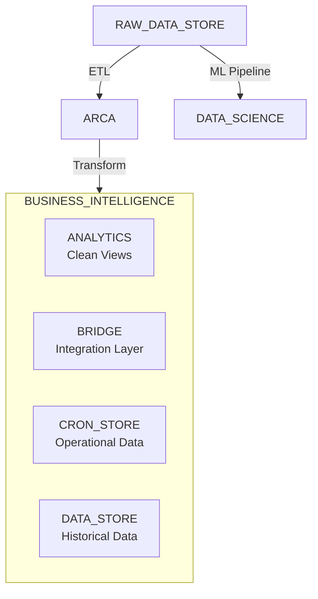

# Data Intelligence Data Catalog

## Overview

Comprehensive catalog of Happy Money's data architecture, including databases, schemas, tables, views, and their relationships. Essential reference for data analysis, reporting, and ticket resolution.

## Navigation

### 🚀 Quick Start
- [Essential Tables](#essential-tables) - Most commonly used tables
- [Key Identifiers](#key-identifiers) - Cross-system join fields
- [Critical Filters](#critical-filters) - Required schema filters
- [Common Patterns](#common-patterns) - Frequently used SQL patterns

### 📊 Databases & Schemas
- [BUSINESS_INTELLIGENCE](#business_intelligence-database) - Primary analytics database
- [ARCA](#arca-database) - Loan management system
- [RAW_DATA_STORE](#raw_data_store-database) - Source system data
- [DATA_SCIENCE](#data_science-database) - ML and verification data

### 🔧 Technical Reference  
- [Join Patterns](#join-patterns) - Relationship mappings
- [Schema Filtering](#schema-filtering) - Multi-instance handling
- [Query Patterns](#query-patterns) - SQL templates
- [Data Quality](#data-quality-notes) - Known issues

## 🚀 Quick Start Guide

### Essential Tables

| Table/View | Database.Schema | Purpose | Primary Key |
|------------|----------------|---------|-------------|
| `VW_LOAN` | BI.ANALYTICS | Master loan table | LOAN_ID |
| `VW_LP_PAYMENT_TRANSACTION` | BI.ANALYTICS | Payment history | PAYMENT_ID |
| `VW_LOAN_PORTFOLIOS_AND_SUB_PORTFOLIOS` | BI.ANALYTICS | Portfolio assignments | LOAN_ID, PORTFOLIO_ID |
| `DSH_GR_DAILY_ROLL_TRANSITION` | BI.CRON_STORE | Daily roll rates | PAYOFFUID, ASOFDATE |
| `RPT_OUTBOUND_LISTS_HIST` | BI.CRON_STORE | SIMM placements | PAYOFFUID, SET_NAME, DATE |

### Key Identifiers

| Identifier | Usage | Format | Notes |
|------------|-------|--------|-------|
| `LEAD_GUID` | Cross-system joins | UUID | **Most reliable** |
| `PAYOFFUID` | Roll rates, collections | String | Primary for analytics |
| `LOAN_ID` | System-specific | Integer/String | May need CAST() |
| `LEGACY_LOAN_ID` | User-friendly | HM[number] | Display purposes |

### Critical Filters

```sql
-- ALWAYS apply these filters to avoid duplicates:

-- Originated Loans
WHERE SCHEMA_NAME = ARCA.CONFIG.LMS_SCHEMA()

-- Applications  
WHERE SCHEMA_NAME = ARCA.CONFIG.LOS_SCHEMA()

-- SIMM Placements
WHERE SET_NAME = 'SIMM' AND SUPPRESSION_FLAG = FALSE

-- Native LoanPro Payments
WHERE IS_MIGRATED = 0
```

### Common Patterns

<details>
<summary>📋 Standard Loan Join</summary>

```sql
SELECT l.*, p.TRANSACTION_DATE, p.TRANSACTION_AMOUNT
FROM BUSINESS_INTELLIGENCE.ANALYTICS.VW_LOAN l
JOIN BUSINESS_INTELLIGENCE.ANALYTICS.VW_LP_PAYMENT_TRANSACTION p
    ON UPPER(p.loan_id::TEXT) = UPPER(l.loan_id::TEXT)
WHERE p.IS_MIGRATED = 0
```
</details>

<details>
<summary>📋 Portfolio Flattening</summary>

```sql
WITH portfolio_summary AS (
    SELECT LOAN_ID,
           LISTAGG(DISTINCT PORTFOLIO_NAME, '; ') AS ALL_PORTFOLIOS
    FROM VW_LOAN_PORTFOLIOS_AND_SUB_PORTFOLIOS
    GROUP BY LOAN_ID
)
```
</details>

<details>
<summary>📋 Schema-Filtered Status</summary>

```sql
JOIN VW_LOAN_SETTINGS_ENTITY_CURRENT ls
    ON l.loan_id = ls.loan_id 
    AND ls.SCHEMA_NAME = BUSINESS_INTELLIGENCE.CONFIG.LMS_SCHEMA()
JOIN VW_LOAN_SUB_STATUS_ENTITY_CURRENT s
    ON ls.loan_sub_status_id = s.id
    AND s.SCHEMA_NAME = BUSINESS_INTELLIGENCE.CONFIG.LMS_SCHEMA()
```
</details>

## 📊 Database Architecture



| Database | Purpose | Key Schemas |
|----------|---------|-------------|
| **BUSINESS_INTELLIGENCE** | Primary analytics & reporting | ANALYTICS, BRIDGE, CRON_STORE, DATA_STORE |
| **ARCA** | Loan management system | FRESHSNOW, CONFIG |
| **RAW_DATA_STORE** | Source system ingestion | KAFKA, PLAID |
| **DATA_SCIENCE** | ML & verification | MODEL_VAULT |

## 🏦 BUSINESS_INTELLIGENCE Database

### ANALYTICS Schema
> Clean, business-ready views optimized for reporting and analysis

#### 📈 Core Tables

<details>
<summary><b>VW_LOAN</b> - Master loan table</summary>

| Field | Type | Description |
|-------|------|-------------|
| **LOAN_ID** | PK | System loan identifier |
| **LEAD_GUID** | FK | Cross-system identifier (most reliable) |
| LEGACY_LOAN_ID | String | User-friendly ID (HM format) |
| ORIGINATION_DATE | Date | Loan funding date |
| LOAN_AMOUNT | Number | Principal amount |
| PARTNER_ID | FK | → VW_PARTNER.PARTNER_ID |

```sql
-- Standard join pattern
JOIN VW_LOAN l ON UPPER(source.lead_guid) = UPPER(l.lead_guid)
```
</details>

<details>
<summary><b>VW_LP_PAYMENT_TRANSACTION</b> - Payment history</summary>

| Field | Type | Description |
|-------|------|-------------|
| **PAYMENT_ID** | PK | Transaction identifier |
| **LOAN_ID** | FK | → VW_LOAN.LOAN_ID |
| TRANSACTION_DATE | Date | Transaction date |
| TRANSACTION_AMOUNT | Number | Total amount |
| IS_MIGRATED | Flag | 0=Native, 1=Migrated |

```sql
-- Join with type casting
JOIN VW_LP_PAYMENT_TRANSACTION lp 
    ON UPPER(lp.loan_id::TEXT) = UPPER(vl.loan_id::TEXT)
WHERE lp.IS_MIGRATED = 0  -- Native transactions only
```
</details>

<details>
<summary><b>VW_LOAN_PORTFOLIOS_AND_SUB_PORTFOLIOS</b> - Portfolio assignments</summary>

| Field | Type | Description |
|-------|------|-------------|
| **LOAN_ID** | PK | → VW_LOAN.LOAN_ID |
| **PORTFOLIO_ID** | PK | → VW_PARTNER.PORTFOLIO_ID |
| PORTFOLIO_NAME | String | Portfolio classification |
| SUB_PORTFOLIO_NAME | String | Sub-classification |

**Common Portfolios:**
- `First Party Fraud - Confirmed`
- `Settlement Setup` / `Settlement Successful`
- `Theorem Main Master Fund LP`

```sql
-- Flatten multiple portfolios
SELECT LOAN_ID,
       LISTAGG(DISTINCT PORTFOLIO_NAME, '; ') AS ALL_PORTFOLIOS
FROM VW_LOAN_PORTFOLIOS_AND_SUB_PORTFOLIOS
GROUP BY LOAN_ID
```
</details>

<details>
<summary><b>VW_PARTNER</b> - Partner/investor information</summary>

| Field | Type | Description |
|-------|------|-------------|
| **PARTNER_ID** | PK | Partner identifier |
| PARTNER_NAME | String | Organization name |
| PORTFOLIO_ID | String | Portfolio identifier |

> Reference table for investor reporting and ownership tracking
</details>

### BRIDGE Schema  
> Integration layer between source systems and analytics

#### ⚠️ Critical Tables

<details>
<summary><b>VW_BANK_INFO</b> - Banking accounts (LOS ONLY)</summary>

⚠️ **CRITICAL LIMITATION:** Hardcoded to LOS schema - applications only!

| Field | Type | Description |
|-------|------|-------------|
| **LOAN_ID** | PK | Application ID (LOS only) |
| ROUTING_NUMBER | String | 9-digit ABA number |
| ACCOUNT_NUMBER | String | Bank account |
| BANK_NAME | String | ⚠️ Always "placeholder name" |

```sql
-- For LMS loans, use CTE workaround:
WITH lms_bank_info AS (
    SELECT le.id AS LOAN_ID, cae.ROUTING_NUMBER
    FROM ARCA.FRESHSNOW.loan_entity_current le
    -- [banking chain joins]
    WHERE le.SCHEMA_NAME = ARCA.config.lms_schema()
)
```
</details>

<details>
<summary><b>VW_LOAN_ENTITY_CURRENT</b> - Core entity table</summary>

| Field | Type | Description |
|-------|------|-------------|
| **ID** | PK | Entity identifier |
| DISPLAY_ID | String | User-friendly ID |
| CREATED | Timestamp | Creation date |
| SCHEMA_NAME | String | **Critical filter field** |

⚠️ **Always filter by SCHEMA_NAME:**
- `ARCA.CONFIG.LOS_SCHEMA()` = Applications
- `ARCA.CONFIG.LMS_SCHEMA()` = Originated loans
</details>

<details>
<summary><b>VW_LOAN_SETTINGS_ENTITY_CURRENT</b> - Settings & status</summary>

| Field | Type | Description |
|-------|------|-------------|
| **ID** | PK | ⚠️ Settings ID (NOT loan ID!) |
| **LOAN_ID** | FK | → VW_LOAN_ENTITY_CURRENT.ID |
| LOAN_SUB_STATUS_ID | FK | → VW_LOAN_SUB_STATUS_ENTITY_CURRENT.ID |
| SCHEMA_NAME | String | **Required filter** |

```sql
-- ⚠️ CORRECT: Use LOAN_ID field for joins
JOIN VW_LOAN_SETTINGS_ENTITY_CURRENT lsec
    ON table.LOAN_ID = lsec.LOAN_ID  -- NOT lsec.ID!
    AND lsec.SCHEMA_NAME = ARCA.CONFIG.LMS_SCHEMA()
```
</details>

<details>
<summary><b>VW_LOAN_SUB_STATUS_ENTITY_CURRENT</b> - Status descriptions</summary>

| Field | Type | Description |
|-------|------|-------------|
| **ID** | PK | Status identifier |
| TITLE | String | Human-readable status |
| SCHEMA_NAME | String | **Required filter** |

> Reference table for status text lookups
</details>

<details>
<summary><b>VW_LOAN_CUSTOMER_CURRENT</b> - Customer relationships</summary>

| Field | Type | Description |
|-------|------|-------------|
| **LOAN_ID** | PK | → VW_LOAN_ENTITY_CURRENT.ID |
| **CUSTOMER_ID** | PK | Customer identifier |
| SCHEMA_NAME | String | **Required filter** |
</details>

## 🏢 ARCA Database

### FRESHSNOW Schema
> Real-time loan management data

<details>
<summary><b>VW_LOS_CUSTOM_LOAN_SETTINGS_CURRENT</b> - Application custom fields</summary>

✅ **No schema filter needed** - LOS-specific view

| Field | Type | Description |
|-------|------|-------------|
| **LOAN_ID** | PK | Application ID |
| APPLICATION_GUID | String | = LEAD_GUID |
| FRAUD_STATUS | String | Investigation status |
| FRAUD_REASON | String | Fraud type |
| OFFER_DECISION_STATUS | String | Approve/Decline |

**Mirror:** `BUSINESS_INTELLIGENCE.BRIDGE.VW_LOS_CUSTOM_LOAN_SETTINGS_CURRENT`
</details>

<details>
<summary><b>VW_APP_PORTFOLIOS_AND_SUB_PORTFOLIOS</b> - Application portfolios</summary>

| Field | Type | Description |
|-------|------|-------------|
| **APPLICATION_ID** | PK | Application identifier |
| **PORTFOLIO_NAME** | PK | Portfolio name |
| PORTFOLIO_CATEGORY | String | Category (e.g., 'Fraud') |

```sql
-- Fraud detection pattern
SELECT APPLICATION_ID,
       LISTAGG(PORTFOLIO_NAME, ',') AS fraud_portfolios
FROM VW_APP_PORTFOLIOS_AND_SUB_PORTFOLIOS
WHERE PORTFOLIO_CATEGORY = 'Fraud'
GROUP BY APPLICATION_ID
```
</details>

<details>
<summary><b>VW_CLS_PAYMENT_TRANSACTION</b> - Legacy payments</summary>

| Field | Type | Description |
|-------|------|-------------|
| **NAME** | PK | Transaction ID |
| LOAN_TRANSACTION_DATE | Date | Transaction date |
| LOAN_TRANSACTION_AMOUNT | Number | Amount |

> Legacy CLS data - requires complex DATA_STORE joins
</details>


<details>
<summary><b>VW_LMS_CUSTOM_LOAN_SETTINGS_CURRENT</b> - Loan custom fields</summary>

| Field | Type | Description |
|-------|------|-------------|
| **LOAN_ID** | PK | → VW_LOAN.LOAN_ID |
| LEAD_GUID | String | Cross-system ID |
| FRAUD_CONFIRMED_DATE | Date | Fraud confirmation |
| PLACEMENT_STATUS | String | Collection agency |

**Placement Values:** HM, Bounce, Resurgent, First Tech Credit Union, ACU, ARS, Remitter, Jefferson Capital
</details>

### CRON_STORE Schema
> Dynamic tables for operational analytics

#### 📈 Roll Rate Analysis Tables

<details>
<summary><b>DSH_GR_DAILY_ROLL_TRANSITION</b> - Daily roll rates</summary>

| Field | Type | Description |
|-------|------|-------------|
| **PAYOFFUID** | PK | Loan identifier |
| **ASOFDATE** | PK | Analysis date |
| CURRENT_DPD_STATUS | String | Current bucket |
| ROLL_STATUS | String | Better/Worse/No change |
| CURRENT_SIMM_PLACEMENT_FLAG | Flag | Active SIMM (0/1) |
| HISTORICAL_SIMM_PLACEMENT_FLAG | Flag | Ever SIMM (0/1) |

```sql
-- Monthly comparison
JOIN monthly_loan_tape mlt
    ON dlt.PAYOFFUID = mlt.PAYOFFUID
    AND dateadd(month,-1,date_trunc(month,dlt.ASOFDATE)) = 
        date_trunc(month,mlt.ASOFDATE)
```

🚀 **Performance:** 40-60% optimized via CTE consolidation
</details>

<details>
<summary><b>VW_DSH_MONTHLY_ROLL_RATE_MONITORING</b> - Monthly roll rates</summary>

| Field | Type | Description |
|-------|------|-------------|
| **PAYOFFUID** | PK | Loan identifier |
| **ASOFDATE** | PK | Month-end date |
| CURRENT_SIMM_PLACEMENT_FLAG | Flag | Monthly SIMM (0/1) |
| HISTORICAL_SIMM_PLACEMENT_FLAG | Flag | Ever SIMM (0/1) |

> Monthly aggregation of daily roll rates
</details>

<details>
<summary><b>RPT_OUTBOUND_LISTS</b> - Daily outbound campaign lists</summary>

| Field | Type | Description |
|-------|------|-------------|
| **LOAD_DATE** | PK | Date of list generation |
| **SET_NAME** | PK | Campaign set identifier |
| **LIST_NAME** | String | Specific list name |
| **PAYOFFUID** | PK | Customer identifier |
| SUPPRESSION_FLAG | Boolean | Whether customer is suppressed |
| LOAN_TAPE_ASOFDATE | Date | Loan data as-of date |

> Primary operational table for daily outbound campaign list generation
</details>

<details>
<summary><b>RPT_OUTBOUND_LISTS_HIST</b> - Historical outbound campaign lists</summary>

| Field | Type | Description |
|-------|------|-------------|
| **PAYOFFUID** | PK | Customer identifier |
| **SET_NAME** | PK | Campaign set (e.g., 'SIMM') |
| **LOAD_DATE** | PK | List generation date |
| LIST_NAME | String | Specific list name |
| SUPPRESSION_FLAG | Boolean | FALSE = Active |
| LOAN_TAPE_ASOFDATE | Date | Loan data as-of date |

**SIMM Statistics:**
- Manages ~47% of delinquent loans
- Daily activity: ~0.61% of portfolio
- Historical: ~1.77% of portfolio

```sql
-- Current placement
WHERE SET_NAME = 'SIMM' 
  AND SUPPRESSION_FLAG = FALSE
  AND LOAN_TAPE_ASOFDATE = target_date

-- Historical placement
SELECT PAYOFFUID, MIN(LOAN_TAPE_ASOFDATE) as FIRST_SIMM
FROM RPT_OUTBOUND_LISTS_HIST
WHERE SET_NAME = 'SIMM' AND SUPPRESSION_FLAG = FALSE
GROUP BY PAYOFFUID
```
</details>

<details>
<summary><b>RPT_OUTBOUND_LISTS_SUPPRESSION</b> - Campaign suppression tracking</summary>

| Field | Type | Description |
|-------|------|-------------|
| **LOAD_DATE** | PK | Date of suppression |
| **SUPPRESSION_TYPE** | PK | Global, Set, List, Cross Set, Cross List |
| **SUPPRESSION_REASON** | PK | Specific reason for suppression |
| **PAYOFF_UID** | PK | Customer identifier |
| SET_NAME | String | Campaign set (if applicable) |
| LIST_NAME | String | Specific list (if applicable) |

> Tracks suppression reasons for compliance and audit trail
</details>

<details>
<summary><b>RPT_OUTBOUND_LISTS_SUPPRESSION_HIST</b> - Historical suppression tracking</summary>

| Field | Type | Description |
|-------|------|-------------|
| **LOAD_DATE** | PK | Date of suppression |
| **SUPPRESSION_TYPE** | PK | Global, Set, List, Cross Set, Cross List |
| **SUPPRESSION_REASON** | PK | Specific reason for suppression |
| **PAYOFF_UID** | PK | Customer identifier |
| SET_NAME | String | Campaign set (if applicable) |
| LIST_NAME | String | Specific list (if applicable) |

> Historical audit trail of all suppression decisions for compliance tracking
</details>

<details>
<summary><b>RPT_TRANSITION_MATRIX_MONTHLY</b> - Transition matrix</summary>

| Field | Type | Description |
|-------|------|-------------|
| **PAYOFFUID** | PK | Loan identifier |
| **DATECURRENT** | PK | Current period |
| DPD | Number | Days past due |
| ROLL | String | Direction indicator |

> Foundation for roll rate calculations
</details>

### DATA_STORE Schema
> Historical snapshots and materialized views

<details>
<summary><b>MVW_LOAN_TAPE_DAILY_HISTORY</b> - Daily loan snapshots</summary>

| Field | Type | Description |
|-------|------|-------------|
| **LOANID** | PK | Loan identifier |
| **ASOFDATE** | PK | Snapshot date |
| PAYOFFUID | String | Cross-system ID |
| DAYSPASTDUE | Number | DPD |
| REMAININGPRINCIPAL | Number | Balance |

> Historical daily loan performance data
</details>

<details>
<summary><b>MVW_LOAN_TAPE_MONTHLY</b> - Monthly loan snapshots</summary>

| Field | Type | Description |
|-------|------|-------------|
| **LOANID** | PK | Loan identifier |
| **ASOFDATE** | PK | Month-end date |
| PAYOFFUID | String | Cross-system ID |
| DAYSPASTDUE | Number | DPD |
| LOAN_INTENT | String | Classification |

> Monthly aggregated loan performance
</details>

<details>
<summary><b>MVW_APPL_STATUS_TRANSITION</b> - Marketing attribution</summary>

| Field | Type | Description |
|-------|------|-------------|
| **PAYOFFUID** | PK | Loan identifier |
| LAST_TOUCH_UTM_CHANNEL_GROUPING | String | Marketing channel |

> Channel attribution for performance analysis
</details>

## 📎 RAW_DATA_STORE Database

### KAFKA Schema
> Real-time external data ingestion

<details>
<summary><b>PLAID_* Tables</b> - Financial data from Plaid API</summary>

**Tables:**
- `PLAID_TRANSACTIONS` - Transaction history
- `PLAID_AUTH` - Account authentication
- `PLAID_LINKS` - Connection metadata
- `PLAID_ASSET_DATA` - Asset reports

**Structure:** All tables have VARIANT columns:
- `RECORD_METADATA` - Kafka metadata
- `RECORD_CONTENT` - Plaid payload

```sql
-- Flatten transaction data
SELECT record_content:lead_guid::STRING as LEAD_GUID,
       f.value:amount::FLOAT as AMOUNT,
       f.value:date::DATE as TRANSACTION_DATE
FROM RAW_DATA_STORE.KAFKA.PLAID_TRANSACTIONS,
LATERAL FLATTEN(input => record_content:payload:transactions) f
```
</details>

## 🧪 DATA_SCIENCE Database

### MODEL_VAULT Schema
> ML models and third-party verification data

<details>
<summary><b>VW_OSCILAR_VERIFICATIONS</b> - Third-party verification</summary>

**Data Structure:** Single VARIANT column with nested JSON
- `data.input.payload` - Application data (SSN, employment, income)
- `data.integrations[]` - Verification results
  - `giact_5_8` - Bank account verification
  - `equifax_talx` - Employment/income (The Work Number)
- `data.status` - Processing status

```sql
SELECT data:data.input.payload.applicationId::STRING as APP_ID,
       data:data.integrations[0].name::STRING as INTEGRATION,
       data:data.integrations[0].response as RESPONSE
FROM DATA_SCIENCE.MODEL_VAULT.VW_OSCILAR_VERIFICATIONS
WHERE data:data.status = 'processed'
```
</details>


---

## 📋 Contributing

When working with new database objects:
1. Add to appropriate database section using collapsible details
2. Document key fields with business context
3. Include common join patterns and filters
4. Note any data quality issues or limitations
5. Update Quick Start section if introducing new common patterns

> This catalog grows with each ticket resolution - keep it concise and practical!

## 🔧 Technical Reference

### Join Patterns

<details>
<summary>📋 <b>LOS Application Analysis</b> - Complete fraud detection pattern</summary>

```sql
-- Complete LOS fraud analysis with all filters
SELECT 
    bi.LOAN_ID as APPLICATION_ID,
    bi.ROUTING_NUMBER,
    le.CREATED as APPLICATION_DATE,
    lssec.TITLE as STATUS,
    cls.FRAUD_STATUS,
    fp.fraud_portfolios
FROM BUSINESS_INTELLIGENCE.BRIDGE.VW_BANK_INFO bi
-- Core entity (ALWAYS filter schema)
JOIN BUSINESS_INTELLIGENCE.BRIDGE.VW_LOAN_ENTITY_CURRENT le 
    ON bi.LOAN_ID = le.ID 
    AND le.SCHEMA_NAME = ARCA.CONFIG.LOS_SCHEMA()
-- Settings (use LOAN_ID field, NOT ID!)
JOIN BUSINESS_INTELLIGENCE.BRIDGE.VW_LOAN_SETTINGS_ENTITY_CURRENT lsec
    ON bi.LOAN_ID = lsec.LOAN_ID
    AND lsec.SCHEMA_NAME = ARCA.CONFIG.LOS_SCHEMA()
-- Status text
JOIN BUSINESS_INTELLIGENCE.BRIDGE.VW_LOAN_SUB_STATUS_ENTITY_CURRENT lssec
    ON lsec.LOAN_SUB_STATUS_ID = lssec.ID 
    AND lssec.SCHEMA_NAME = ARCA.CONFIG.LOS_SCHEMA()
-- Custom fields (no schema filter - LOS specific)
JOIN ARCA.FRESHSNOW.VW_LOS_CUSTOM_LOAN_SETTINGS_CURRENT cls
    ON le.ID = cls.LOAN_ID
-- Fraud portfolios
LEFT JOIN (
    SELECT APPLICATION_ID,
           LISTAGG(PORTFOLIO_NAME, ', ') AS fraud_portfolios
    FROM VW_APP_PORTFOLIOS_AND_SUB_PORTFOLIOS
    WHERE PORTFOLIO_CATEGORY = 'Fraud'
    GROUP BY APPLICATION_ID
) fp ON bi.LOAN_ID = fp.APPLICATION_ID
WHERE le.ACTIVE = 1 AND le.DELETED = 0
```
</details>

<details>
<summary>📋 <b>Standard Loan + Payments</b> - Most common pattern</summary>

```sql
SELECT l.LOAN_ID, l.LEAD_GUID, p.TRANSACTION_DATE, p.TRANSACTION_AMOUNT
FROM BUSINESS_INTELLIGENCE.ANALYTICS.VW_LOAN l
JOIN BUSINESS_INTELLIGENCE.ANALYTICS.VW_LP_PAYMENT_TRANSACTION p
    ON UPPER(p.loan_id::TEXT) = UPPER(l.loan_id::TEXT)
WHERE p.IS_MIGRATED = 0  -- Native LoanPro only
```
</details>

<details>
<summary>📋 <b>Roll Rate Analysis</b> - Monthly comparison</summary>

```sql
-- Daily roll with monthly comparison
SELECT drt.PAYOFFUID, drt.ASOFDATE, drt.ROLL_STATUS,
       drt.CURRENT_SIMM_PLACEMENT_FLAG
FROM BUSINESS_INTELLIGENCE.CRON_STORE.DSH_GR_DAILY_ROLL_TRANSITION drt
JOIN BUSINESS_INTELLIGENCE.DATA_STORE.MVW_LOAN_TAPE_MONTHLY mlt
    ON drt.PAYOFFUID = mlt.PAYOFFUID
    AND dateadd(month,-1,date_trunc(month,drt.ASOFDATE)) = 
        date_trunc(month,mlt.ASOFDATE)
```
</details>

### Schema Filtering

⚠️ **CRITICAL:** Always apply schema filters to avoid duplicates

| System | Filter | Usage |
|--------|--------|-------|
| Applications | `SCHEMA_NAME = ARCA.CONFIG.LOS_SCHEMA()` | Pre-funding |
| Originated Loans | `SCHEMA_NAME = ARCA.CONFIG.LMS_SCHEMA()` | Post-funding |

**Pre-filtered Tables:** Views with LOS/LMS in name don't need schema filters
- ✅ `VW_LOS_CUSTOM_LOAN_SETTINGS_CURRENT` = Applications only
- ✅ `VW_LMS_CUSTOM_LOAN_SETTINGS_CURRENT` = Loans only

### Query Patterns

<details>
<summary>📋 <b>Portfolio Flattening</b> - Multiple portfolios per loan</summary>

```sql
WITH portfolio_summary AS (
    SELECT LOAN_ID,
           LISTAGG(DISTINCT PORTFOLIO_NAME, '; ') AS all_portfolios,
           COUNT(DISTINCT PORTFOLIO_NAME) as portfolio_count
    FROM VW_LOAN_PORTFOLIOS_AND_SUB_PORTFOLIOS
    GROUP BY LOAN_ID
)
```
</details>

<details>
<summary>📋 <b>Binary Classification</b> - Convert categories to flags</summary>

```sql
SELECT loan_id,
       MAX(CASE WHEN portfolio_name LIKE '%Fraud%' THEN 1 ELSE 0 END) as is_fraud,
       MAX(CASE WHEN portfolio_name LIKE '%Settlement%' THEN 1 ELSE 0 END) as is_settlement
FROM VW_LOAN_PORTFOLIOS_AND_SUB_PORTFOLIOS
GROUP BY loan_id
```
</details>

<details>
<summary>📋 <b>SIMM Placement Analysis</b></summary>

```sql
-- Current placements
SELECT COUNT(*) as current_simm_count
FROM RPT_OUTBOUND_LISTS_HIST
WHERE SET_NAME = 'SIMM' 
  AND SUPPRESSION_FLAG = FALSE
  AND LOAN_TAPE_ASOFDATE = CURRENT_DATE()

-- Historical first placements
WITH first_simm AS (
    SELECT PAYOFFUID, MIN(LOAN_TAPE_ASOFDATE) as first_simm_date
    FROM RPT_OUTBOUND_LISTS_HIST
    WHERE SET_NAME = 'SIMM' AND SUPPRESSION_FLAG = FALSE
    GROUP BY PAYOFFUID
)
```
</details>

### Data Quality Notes

⚠️ **Critical Issues:**

| Issue | Problem | Solution |
|-------|---------|----------|
| Bank Names | `VW_BANK_INFO.BANK_NAME` = "placeholder name" | Use routing number + external lookup |
| Schema Mixing | Duplicate records from multiple instances | Always apply schema filters |
| Data Types | Integer vs String LOAN_ID | Use `CAST(field::TEXT)` |
| Missing Data | Recent loans lack payment history | Check origination date |

**Fraud Detection Strategy:**
```sql
-- Use inclusive OR logic due to scattered data
WHERE portfolio_name LIKE '%Fraud%'
   OR fraud_status IS NOT NULL
   OR loan_status LIKE '%Fraud%'
```


