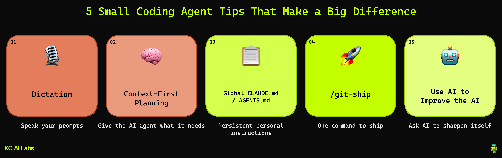

# 5 Small Coding Agent Tips That Make a Big Difference

**Video:** [5 Small Coding Agent Tips That Make a Big Difference](https://www.youtube.com/watch?v=SDEtP1msjos)

A quick reference for all 5 tips covered in the video, with links and example files.



---

## Tips

1. [Dictation / Voice Input](#tip-1-dictation--voice-input)
2. [Context-First Planning](#tip-2-context-first-planning)
3. [Global CLAUDE.md / AGENTS.md](#tip-3-global-claudemd--agentsmd)
4. [/git:ship Skill](#tip-4-gitship-skill)
5. [Use AI to Improve the AI](#tip-5-use-ai-to-improve-the-ai)

**Bonus:** [/encourage Skill — research-backed encouragement for hard problems](#bonus-encourage-skill)

---

## Tip 1: Dictation / Voice Input

Stop typing everything from scratch. Use built-in OS or browser dictation to speak your prompts — especially useful for longer, conversational requests.

**Resources:**
- [macOS Dictation](https://support.apple.com/guide/mac-help/use-dictation-mh40584/mac)
- [Google Docs Voice Typing](https://support.google.com/docs/answer/4492226?hl=en)
- [Microsoft Word Dictate](https://support.microsoft.com/en-us/office/dictate-your-documents-in-word-3876e05f-3fcc-418f-b8ab-db7ce0d11d3c)

---

## Tip 2: Context-First Planning

Before writing a prompt, ask: *what context does the AI agent need to answer this well?* The more relevant context you provide upfront (goals, constraints, existing code), the better the output.

**Resources:**

- **Claude Code:** [Best Practices](https://code.claude.com/docs/en/best-practices) · [Common Workflows](https://code.claude.com/docs/en/common-workflows)
- **Cursor:** [Agent Best Practices](https://cursor.com/blog/agent-best-practices) · [Rules for AI / Context](https://cursor.com/docs/context/rules)
- **GitHub Copilot:** [Best Practices](https://docs.github.com/en/copilot/get-started/best-practices) · [Agent Best Practices](https://docs.github.com/copilot/how-tos/agents/copilot-coding-agent/best-practices-for-using-copilot-to-work-on-tasks)
- **Windsurf:** [Context Awareness Overview](https://docs.windsurf.com/context-awareness/overview) · [Getting Started](https://docs.windsurf.com/windsurf/getting-started)
- **Codex:** [CLI Overview](https://developers.openai.com/codex/cli) · [AGENTS.md Guide](https://developers.openai.com/codex/guides/agents-md)
- **Context Engineering Frameworks (all agents):** [Superpowers / MCP](https://claude.com/plugins/superpowers) · [taches-cc-resources](https://github.com/glittercowboy/taches-cc-resources)

---

## Tip 3: Global CLAUDE.md / AGENTS.md

Put your personal preferences, tone, workflow rules, and standing instructions in a global `CLAUDE.md` (or `AGENTS.md` for Codex). The AI reads these automatically at the start of every session — no need to re-explain yourself each time.

**Example files in this repo:**
- [`global_context_examples/CLAUDE.md`](./global_context_examples/CLAUDE.md) — global CLAUDE.md example (`~/.claude/CLAUDE.md`)
- [`global_context_examples/AGENTS.md`](./global_context_examples/AGENTS.md) — Codex equivalent (`~/.codex/AGENTS.md`)

**Where to put these files:**
- Claude Code: `~/.claude/CLAUDE.md`
- Codex: `~/.codex/AGENTS.md`

---

## Tip 4: /git:ship Skill

A custom skill that handles the full git shipping workflow in one command: stage → commit → push → PR → squash merge. Invoke it with `/git:ship`.

**Example file in this repo:**
- [`git-ship/SKILL.md`](./git-ship/SKILL.md) — the skill definition used in the demo

**Where to put skills:**
- Claude Code: `~/.claude/skills/<skill-name>/SKILL.md`

---

## Tip 5: Use AI to Improve the AI

Use your AI agent to write or refine your own global context file, hooks, and skills. The meta-loop: ask the agent what context it would need to help you better, then add that to your global instructions.

**Resources (Claude Code examples — other agents have equivalent features):**
- [Cursor Marketplace](https://cursor.com/marketplace) — plugins, automations, and extensions for Cursor
- [Claude Plugins](https://claude.com/plugins) — directory for Claude Code and Cowork
- [Claude Code Plugins / Extensions](https://code.claude.com/docs/en/discover-plugins)
- [Claude Code Skills](https://code.claude.com/docs/en/skills)
- [Claude Code Hooks Guide](https://code.claude.com/docs/en/hooks-guide)

---

## Bonus: /encourage Skill

Telling a language model "you can do this" sounds silly — but published prompt-engineering research shows that simple emotional / motivational framing measurably improves performance on hard tasks. The `/encourage` skill is a small, structured way to apply those findings on demand: when Claude is stuck on a tough problem, type `/encourage` and it will read a short, research-backed message reaffirming capability before continuing the task.

**Why it works (briefly):**
- Microsoft Research's *EmotionPrompt* (2023) showed phrases like "believe in your abilities" and "take pride in your work" lifted LLM performance by ~8% on simple tasks and up to 115% on harder reasoning benchmarks. [arxiv.org/abs/2307.11760](https://arxiv.org/abs/2307.11760)
- A 2025 follow-up on *Verbal Efficacy Stimulations* found encouraging prompts produced the most consistent gains, with the biggest lifts on moderately hard problems — exactly when you'd want this skill. [arxiv.org/abs/2502.06669](https://arxiv.org/abs/2502.06669)
- The skill includes deliberate guardrails because the same research shows positive framing can increase sycophancy: it encourages capability and persistence, not conclusions, and won't make Claude retract a correct objection.

**Example files in this repo:**
- [`encourage/SKILL.md`](./encourage/SKILL.md) — the skill definition
- [`encourage/RESEARCH.md`](./encourage/RESEARCH.md) — fuller summary of the research and design choices

**Where to put skills:**
- Claude Code: `~/.claude/skills/<skill-name>/SKILL.md`

---

## Folder Contents

```
videos/ai_coding_agent_tips/
├── README.md                            ← this file
├── diagram.excalidraw                   ← visual map of the 5 tips
├── diagram.png                          ← rendered diagram (used in README)
├── global_context_examples/
│   ├── CLAUDE.md                        ← global CLAUDE.md example (~/.claude/CLAUDE.md)
│   └── AGENTS.md                        ← global AGENTS.md example (~/.codex/AGENTS.md)
├── git-ship/
│   └── SKILL.md                         ← /git:ship skill definition
└── encourage/
    ├── SKILL.md                         ← /encourage skill definition
    └── RESEARCH.md                      ← background + citations
```
