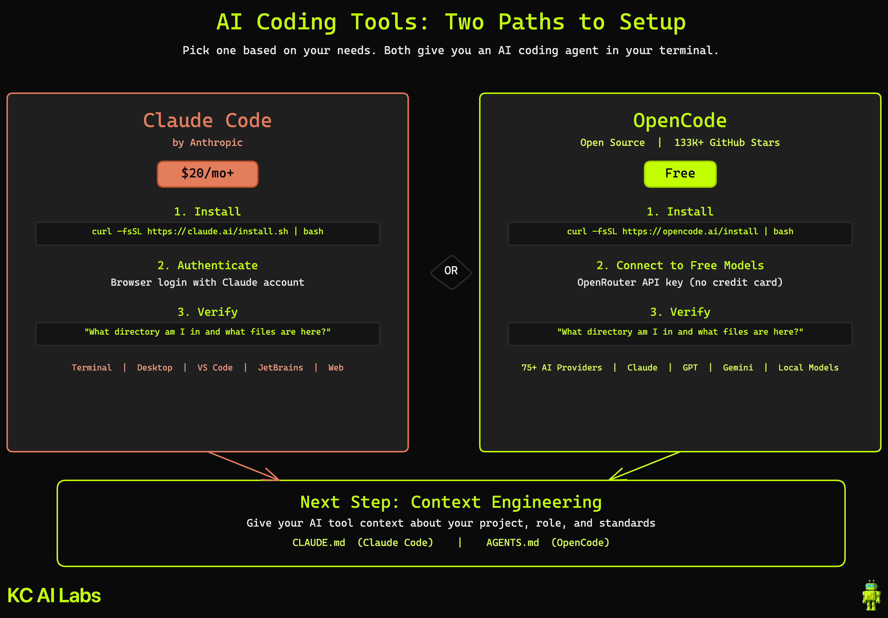

<div align="center">

# Get Set Up with AI Coding Tools in Under 10 Minutes

### One paid, one free. Two terminal commands each. Ready to go.

[](https://claude.ai/download)
[](https://opencode.ai)
[](https://openrouter.ai)

---

| **YouTube** | **Presenter** | **Related** |
|:---:|:---:|:---:|
| [Watch the Video](#) | [Kyle Chalmers](https://www.youtube.com/@kylechalmersdataai) | [AZ Tech Week Workshop](https://partiful.com/e/VPy2EpNYQFppO6ZQA17n) |

</div>

---

## Overview

This video walks you through installing two AI coding tools on your machine: **Claude Code** (paid, from Anthropic) and **OpenCode** (free, open source). Both are terminal-based AI agents that read your files, write code, run commands, and connect to your development tools.

By the end, you'll have at least one working AI coding tool and understand why **context engineering** is the skill that makes these tools actually useful.

---

## Architecture

<div align="center">



</div>

---

## Prerequisites

| Requirement | Details |
|:------------|:--------|
| A computer | Mac, Windows, or Linux |
| Internet connection | For downloading tools and authenticating |
| **For Claude Code** | A [Claude subscription](https://claude.ai/pricing) ($20/month minimum) or [Anthropic Console](https://console.anthropic.com/) account |
| **For OpenCode** | Free. Optionally, an [OpenRouter](https://openrouter.ai) account (also free) for access to free AI models |

---

## Install Claude Code

Claude Code is Anthropic's AI coding agent. It requires a Claude subscription ($20/month+).

### macOS / Linux / WSL

```bash
curl -fsSL https://claude.ai/install.sh | bash
```

### Windows (PowerShell)

```powershell
irm https://claude.ai/install.ps1 | iex
```

> **Windows requires [Git for Windows](https://git-scm.com/downloads/win).** Install it first if you don't have it.

### Alternative: Homebrew (macOS)

```bash
brew install --cask claude-code
```

### Verify Installation

```bash
claude
```

Log in when prompted, then ask:

```
What directory am I in and what files are here?
```

If it responds with your current directory and files, you're set.

> **Prefer a GUI?** Claude Code also has a [desktop app](https://claude.ai/download) and IDE extensions for [VS Code](https://marketplace.visualstudio.com/items?itemName=anthropic.claude-code) and JetBrains.

### Go Deeper

For a full Claude Code walkthrough covering CLAUDE.md, modes, settings, custom commands, and agents, see the [Claude Code Deep Dive](https://www.youtube.com/watch?v=g4g4yBcBNuE).

---

## Install OpenCode (Free)

OpenCode is a free, open-source AI coding agent with 133K+ GitHub stars. It supports 75+ AI providers.

### macOS / Linux / WSL

```bash
curl -fsSL https://opencode.ai/install | bash
```

### Alternative: Homebrew (macOS)

```bash
brew install anomalyco/tap/opencode
```

### Alternative: Windows

```
choco install opencode
```

### Connect to Free Models

OpenCode works with many AI providers. To use free models:

1. Create a free account at [openrouter.ai](https://openrouter.ai) (no credit card required)
2. Go to Settings > Keys and create an API key
3. Configure OpenCode with the key

For the full OpenRouter setup walkthrough, see [Getting Started with AI for Data Analysis for Free](https://youtu.be/bWEs8Umnrwo).

### Verify Installation

```bash
opencode
```

Then ask the same question:

```
What directory am I in and what files are here?
```

Same result. Two tools, same capability, one paid, one free.

---

## Why Context Engineering Matters

Installing a tool is step one. Making it effective is step two.

**Context engineering** is the practice of giving AI tools structured information about your project, role, tools, and standards so they can work effectively. It's the successor to "prompt engineering" as the core AI skill.

In practice, this means creating a file in your project root:

| Tool | Context File | Purpose |
|:-----|:-------------|:--------|
| Claude Code | `CLAUDE.md` | Defines your project, tools, conventions, and workflow |
| OpenCode | `AGENTS.md` | Same concept, different filename |

Think of it like onboarding a new team member. You wouldn't sit them at a desk and say "go." You'd explain how the team works, what tools you use, and what the standards are.

For a deep dive into context engineering with Claude Code, see the [Claude Code Deep Dive](https://www.youtube.com/watch?v=g4g4yBcBNuE).

---

## Key Definitions

| Term | Definition |
|:-----|:-----------|
| **Claude Code** | Anthropic's AI coding agent. Runs in your terminal. Requires a Claude subscription ($20/month minimum). |
| **OpenCode** | Free, open-source AI coding agent. 133K+ GitHub stars. Supports 75+ AI providers. |
| **OpenRouter** | Service providing access to many AI models through one API, including free models. No credit card required. |
| **Context Engineering** | The practice of giving AI tools structured context so they can work effectively. Successor to prompt engineering. |
| **CLAUDE.md** | Markdown file that teaches Claude Code about your project. Read at the start of every session. |
| **AGENTS.md** | The equivalent of CLAUDE.md for OpenCode and other AI tools. |

---

## Resources

### Official Documentation

- [Claude Code Docs](https://code.claude.com/docs/en/overview)
- [Claude Code Download](https://claude.ai/download)
- [OpenCode](https://opencode.ai)
- [OpenCode GitHub](https://github.com/anomalyco/opencode)
- [OpenRouter](https://openrouter.ai)

### KC Labs AI Videos

| Video | What It Covers |
|:------|:---------------|
| [Claude Code Deep Dive](https://www.youtube.com/watch?v=g4g4yBcBNuE) | Full setup, CLAUDE.md, modes, settings, commands, agents |
| [Free AI Data Analysis](https://youtu.be/bWEs8Umnrwo) | OpenCode + BigQuery + OpenRouter complete walkthrough |
| [Settings.json Update](https://www.youtube.com/watch?v=WKt28ytMl3c) | Claude Code settings troubleshooting |

### Workshop

This video serves as the prerequisite for the **AZ Tech Week: Practical AI Playbook Workshop** on April 8, 2026. [RSVP here](https://partiful.com/e/VPy2EpNYQFppO6ZQA17n).

---

<div align="center">

### More from KC Labs AI

[](https://www.youtube.com/@kylechalmersdataai)
[](https://www.linkedin.com/in/kylechalmers/)
[](https://github.com/kyle-chalmers/data-ai-tickets-template)

<sub>Made with Claude Code</sub>

</div>
