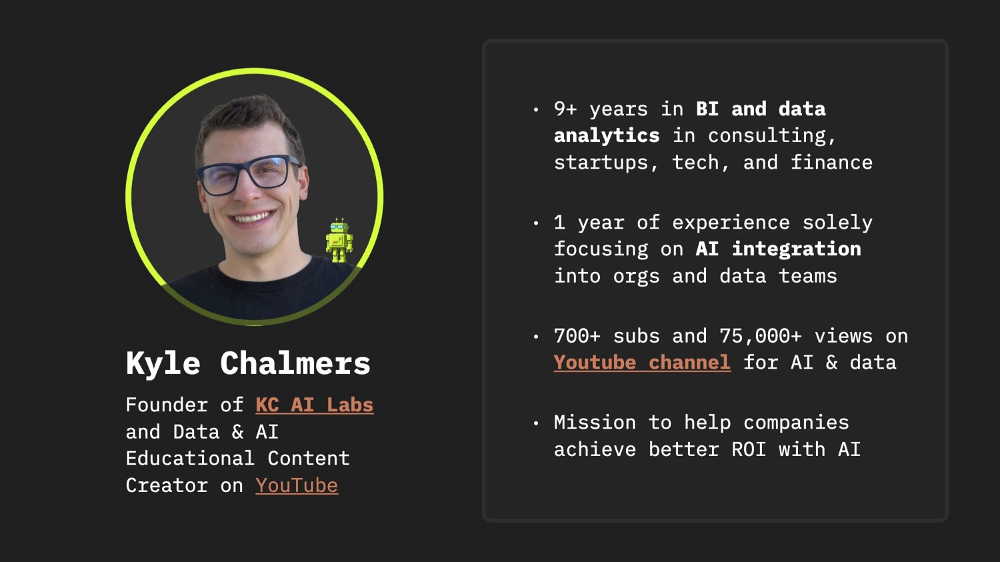
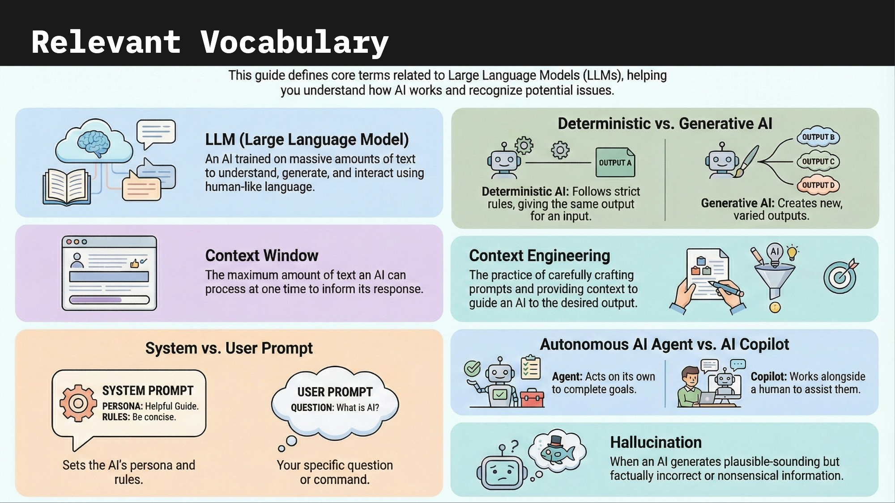
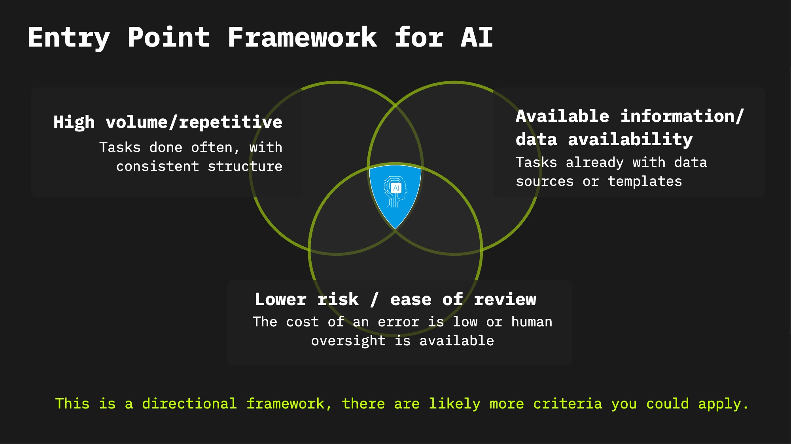
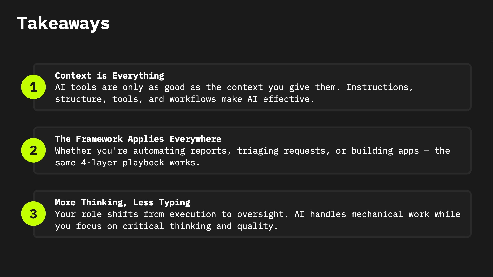

<div align="center">

# The Practical AI Playbook

### Context Engineering Workshop — From AI Curiosity to AI Execution

[](https://claude.ai/download)
[](https://opencode.ai)

---

---

| **LinkedIn** | **YouTube** | **KC Labs AI** | **Curious Questions** | **Sat. Hike & Coffee** |
|:---:|:---:|:---:|:---:|:---:|
|  |  |  |  |  |
| [Connect](https://www.linkedin.com/in/kylechalmers/) | [Subscribe](https://www.youtube.com/@kylechalmersdataai) | [kclabs.ai](https://kclabs.ai) | [Built with AI](https://curiousquestions.life) | [RSVP — Sat. April 11](https://partiful.com/e/vMiPKyrTML8yf8Gnf618) |

</div>

---

## Workshop Flow

```
+---------------------------------------------------------------------------+
|                    WORKSHOP OVERVIEW (5:30 - 8:00 PM)                     |
+---------------------------------------------------------------------------+
|                                                                           |
|  +----------+   +-----------+   +------------------+   +-----------+      |
|  |  Doors   |-->|  Welcome  |-->|    Live Demo     |-->|  Guided   |      |
|  | & Settle |   | & Framing |   | (audience-driven)|   |  Exercise |      |
|  | (15 min) |   |  (15 min) |   |    (35 min)      |   |  (30 min) |      |
|  +----------+   +-----------+   +------------------+   +-----------+      |
|   5:30-5:45      5:45-6:00         6:00-6:35           6:35-7:05         |
|                                                                           |
|                  Audience          Audience shares      Pick a            |
|                  pulse check,      a problem,           scenario,        |
|                  4 layers          Kyle builds           apply the       |
|                  overview          it live               playbook        |
|                                                                           |
|         +--------------------------------------------------------+        |
|         v                                                                 |
|  +----------+   +------------------------------------------------+       |
|  |   Wrap   |-->|        Open Time & Networking (50+ min)        |       |
|  |  (5 min) |   |     Shares, 1-on-1 help, install assistance    |       |
|  +----------+   +------------------------------------------------+       |
|   7:05-7:10                    7:10 - 8:00+                               |
|                                                                           |
+---------------------------------------------------------------------------+
```

---

## Prerequisite: Get Set Up

> [!IMPORTANT]
> **Watch before attending:** [Get Set Up with AI Coding Tools in Under 10 Minutes](https://youtube.com/watch?v=C0HtKPrUhGk)

| Requirement | Details |
|:------------|:--------|
| An AI coding tool installed | [Claude Code](https://claude.ai/download) ($20/mo) or [OpenCode](https://opencode.ai) (free) |
| A business problem to bring | What task do you do repeatedly that takes too long? |
| Laptop with internet | You'll be working hands-on during the exercise |

Don't have a tool installed yet? Two terminal commands:

```bash
# Claude Code (paid)
curl -fsSL https://claude.ai/install.sh | bash

# OpenCode (free)
curl -fsSL https://opencode.ai/install | bash
```

---

## AI Vocabulary

<div align="center">

</div>

---

## Where AI Fits: The Entry Point Framework

<div align="center">

</div>

---

## Context Engineering: The 4 Layers

> [!IMPORTANT]
> **The Key Insight:** The difference between "AI is a toy" and "AI is a productivity multiplier" is the context you give it.

<table>
<tr>
<td width="25%" align="center">

### 1. Instructions

Define the AI's role, expertise, rules, and standards

*CLAUDE.md / AGENTS.md*

</td>
<td width="25%" align="center">

### 2. Structure

Organize your project so the AI can navigate it

*Folders, naming, templates*

</td>
<td width="25%" align="center">

### 3. Tools

Connect the AI to your actual work systems

*CLIs, APIs, MCP servers*

</td>
<td width="25%" align="center">

### 4. Workflows

Custom commands and repeatable patterns

*Slash commands, agents*

</td>
</tr>
</table>

Think of it like onboarding a new team member. You wouldn't sit them at a desk and say "go." You'd explain how the team works, what tools you use, and what the standards are. That's what Context Engineering does for AI.

---

## Live Demo: Your Problem, Solved Live

**The best demos come from real problems.** Tell us what you're working on, and we'll build a solution together using the Context Engineering framework. Don't be shy — shout yours out!

```
+---------------------------------------------------------------------------+
|                      LIVE DEMO FLOW (35 min)                              |
+---------------------------------------------------------------------------+
|                                                                           |
|  +----------+   +-----------+   +------------------+   +-----------+      |
|  | Audience |-->|   Get     |-->|   Build the      |-->|  Run It   |      |
|  | Shares a |   |  Details  |   |   Playbook Live  |   |   Live    |      |
|  | Problem  |   |           |   |                  |   |           |      |
|  +----------+   +-----------+   +------------------+   +-----------+      |
|   "What's a      "What tool      Instructions layer     AI processes      |
|    problem you    do you use?     Structure layer        the problem       |
|    deal with?"    Who gets the    Tools layer            and produces      |
|                   output?"        Workflows layer        output            |
|                                                                           |
+---------------------------------------------------------------------------+
```

### Your Problem or Pick a Scenario

> **Ideal:** Someone describes a real problem they deal with and we solve it live.
> **Backup:** Pick one of these common scenarios as inspiration.

| # | Example Scenario | Example Problem |
|:--|:----------|:----------------|
| 1 | **Automate a recurring report** | "Every Monday I pull numbers from a spreadsheet and email a summary" |
| 2 | **Triage incoming requests** | "I have 40 unread support tickets — categorize and route them" |
| 3 | **Build a simple app or tool** | "I need an internal calculator, form, or dashboard for my team" |
| 4 | **Build or optimize a website** | "I need a landing page or want to improve my site's performance" |
| 5 | **Your own problem** | Describe your real problem in 30 seconds — the best demos are personal |

### Tool Connections Shown Live

Every demo includes a real tool connection — the AI doesn't just write text, it connects to your actual systems:

<div align="center">

| Tool | Purpose | Connection |
|:----:|:--------|:-----------|
| [](https://www.notion.com) | Pull data from databases & docs | [Notion MCP](https://www.notion.com/integrations) (Official) |
| [](https://www.atlassian.com/software/jira) | Read and manage tickets | [Atlassian MCP](https://www.atlassian.com/rovo) |
| [](https://cloud.google.com/bigquery) | Query cloud databases | <kbd>[bq](https://cloud.google.com/bigquery/docs/bq-command-line-tool) query "..."</kbd> |
| [](https://github.com) | Code & deploy | <kbd>[gh](https://cli.github.com/) repo create ...</kbd> |
| [](https://vercel.com) | Deploy websites instantly | <kbd>[vercel](https://vercel.com/docs/cli) deploy</kbd> |

</div>

<details>
<summary><b>Demo Prompts</b> <sup>(click to expand)</sup></summary>

**Automate a Recurring Report**

```text
You are a data analyst who specializes in business reporting. You help automate
recurring reports by pulling data from source systems and producing formatted summaries.

I have customer feedback data in a Notion database that I need to summarize every week.
The database contains dates, categories, ratings, and free-text comments.

Can you help me:
1. Connect to my Notion database and pull the latest feedback data
2. Categorize the feedback by theme (product, service, pricing, etc.)
3. Calculate average ratings by category
4. Identify the top 3 issues and top 3 positive trends
5. Draft a summary email I can send to the leadership team

The output should be concise, data-driven, and ready to send.
```

**Triage Incoming Requests**

```text
You are an operations specialist who helps triage and categorize incoming requests.
You prioritize by urgency and route items to the right team.

I have a backlog of support tickets that need to be categorized and prioritized.
Each ticket has a subject, description, and current status.

Can you help me:
1. Pull the open tickets from our ticketing system
2. Categorize each by type (bug, feature request, question, complaint)
3. Assign priority (critical, high, medium, low) based on the description
4. Group by category and present a summary of what needs attention first
5. Draft routing recommendations for each category

Focus on the tickets that need immediate action.
```

**Build a Simple App or Tool**

```text
You are a software developer who helps build simple internal tools.
You create functional applications from plain-English descriptions.

I need an internal tool for my team. Here's what it should do:
[Audience member describes their tool need]

Can you help me:
1. Create the project structure
2. Build the core functionality
3. Add a clean, simple interface
4. Test it locally
5. Deploy it so the team can access it

Keep it simple — this should be usable today, not perfect.
```

**Build or Optimize a Website**

```text
You are a web developer who specializes in building and optimizing websites.
You create fast, clean sites that look professional.

I need to [create a landing page / improve my existing site].
[Audience member describes their website need]

Can you help me:
1. Set up the project with a modern framework
2. Build the page layout and content
3. Make it responsive and fast
4. Deploy it to a live URL
5. Show me how to update it later

I want something I can show people today.
```

</details>

---

## Guided Exercise: Apply the Playbook (30 min)

**Your turn.** Pick the example scenario closest to your work and apply the Context Engineering framework to your own business problem.

### Pick Your Example Scenario

| # | Example Scenario | Example Problem | Example Tools |
|:--|:----------|:----------------|:--------------|
| 1 | **Automate a recurring report** | "Every Monday I pull sales numbers and email a summary to leadership" | Notion, SQL/BigQuery, Excel, CLI tools |
| 2 | **Triage incoming requests** | "40 unread tickets — categorize by urgency and route to the right team" | Jira, Linear, HubSpot, Slack, email |
| 3 | **Build a simple app or tool** | "I need an internal calculator, intake form, or dashboard for my team" | Claude Code, Next.js, Python, Vercel, GitHub |
| 4 | **Draft communications from raw info** | "Turn meeting notes and project data into a polished stakeholder email" | Notion, Google Docs, Slack, email |
| 5 | **Build or optimize a website** | "Create a landing page or improve my existing site's performance" | Next.js, HTML/CSS, Vercel, GitHub |

### The Playbook (4 Steps)

**Step 0:** Pick your example scenario from the table above (or bring your own)

**Step 1:** Define your AI assistant's role
> "You are a [role] who specializes in [domain]. You help with [tasks]."

**Step 2:** Describe your business problem
> What's the input? What does "done" look like? What constraints matter?

**Step 3:** Give it context
> What files, data, examples, or rules does the AI need? *(This is the "aha" moment)*

**Step 4:** Run it
> Paste your context + problem into your AI tool and see what happens. Iterate.

> [!TIP]
> **No tool installed?** Complete Steps 0-3 — that's the most valuable thinking exercise. Run it after the workshop or get help during open time.

See the full template: [playbook_template.md](./playbook_template.md)

---

## What I Built with AI

These three projects were built entirely with AI coding tools using the same Context Engineering approach we're learning today:

<table>
<tr>
<td width="33%" align="center">

### Curious Questions

A weekly SMS service that sends thought-provoking questions to spark reflection and conversation.

*Next.js, Supabase, Twilio, Vercel*

[curiousquestions.life](https://curiousquestions.life)

</td>
<td width="33%" align="center">

### KC Labs AI Website

Professional consultancy site with portfolio, courses, and contact forms.

*Next.js, Tailwind, Framer Motion, Vercel*

[kclabs.ai](https://kclabs.ai)

</td>
<td width="33%" align="center">

### Video Production Pipeline

8 custom AI skills automating my entire YouTube workflow — brainstorm to marketing.

*Claude Code skills, MCP integrations, Google Drive*

[Watch the channel](https://www.youtube.com/@kylechalmersdataai)

</td>
</tr>
</table>

> Apps, websites, and workflow automation — three completely different domains, all built with Context Engineering.

---

## Key Takeaways

<div align="center">

</div>

---

## Demo Datasets

The following datasets are included in this repo for practicing with the example scenarios:

| Dataset | Rows | Source | Example Scenario |
|:--------|:-----|:-------|:----------|
| [Coffee Shop Sales](./datasets/coffee_shop_sales.csv) | 149K | [Maven Analytics](https://mavenanalytics.io/data-playground/coffee-shop-sales) | Automate a report |
| [Customer Support Tickets](./datasets/support_tickets.csv) | ~8.5K | [Kaggle](https://www.kaggle.com/datasets/suraj520/customer-support-ticket-dataset) | Triage requests |

> [!TIP]
> **Want to use your own data?** Download your [LinkedIn data export](https://www.linkedin.com/mypreferences/d/download-my-data) — connections, messages, endorsements, and more. It takes ~24 hours to generate, but it's a great dataset to practice with.

---

## Context Engineering Resources

After the workshop, go deeper with these resources. Starter templates and a full resource guide are in the [`context_examples/`](./context_examples/) folder.

| Resource | What You'll Learn |
|:---------|:------------------|
| [Claude Code Best Practices](https://code.claude.com/docs/en/best-practices) | The definitive guide — CLAUDE.md, context management, subagents |
| [Effective Context Engineering](https://www.anthropic.com/engineering/effective-context-engineering-for-ai-agents) | Why context beats clever prompts — the theory behind the framework |
| [GSD Framework](https://github.com/gsd-build/get-shit-done) | Structured multi-phase project execution for Claude Code |
| [Superpowers](https://github.com/obra/superpowers) | Composable skills enforcing TDD and development discipline |
| [GitHub Spec Kit](https://github.com/github/spec-kit) | Spec-driven development — works with Claude Code, Copilot, Gemini CLI |

**Starter templates in this repo:**
- [CLAUDE.md / AGENTS.md Starter](./context_examples/CLAUDE_md_starter.md) — fill-in-the-blank template organized by the 4 layers
- [Subagent & Skill Starters](./context_examples/agents_and_skills_starter.md) — templates for extending your AI tool
- [Full Resource Guide](./context_examples/README.md) — curated links, cross-tool reference, recommended reading

---

## Resources

<div align="center">

| | Resource | Link |
|:--:|:---------|:-----|
| **AI Tools** | Claude Code | [claude.ai/download](https://claude.ai/download) |
| | OpenCode (free) | [opencode.ai](https://opencode.ai) |
| | OpenRouter (free models) | [openrouter.ai](https://openrouter.ai) |
| **This Workshop** | Companion Repo | [github.com/kyle-chalmers/data-ai-tickets-template](https://github.com/kyle-chalmers/data-ai-tickets-template) |
| | Playbook Template | [playbook_template.md](./playbook_template.md) |
| | Prerequisite Video | [AI Coding Tools Setup](https://youtube.com/watch?v=C0HtKPrUhGk) |
| **Go Deeper** | Claude Code Deep Dive | [Watch](https://www.youtube.com/watch?v=g4g4yBcBNuE) |
| | Free AI Data Analysis | [Watch](https://youtu.be/bWEs8Umnrwo) |

</div>

---

## More from AZ Tech Week

<div align="center">

### Sat. Morning Hike, Connect, & Coffee

**Saturday, April 11 | 8:30 - 11:00 AM**
Phoenix Mountain Preserve — 40th St. Trailhead

A casual 1-hour hike followed by 90 minutes of coffee, donuts, and networking with fellow tech founders, AI enthusiasts, and business leaders.

[RSVP on Partiful](https://partiful.com/e/vMiPKyrTML8yf8Gnf618)

</div>

---

<details>
<summary><b>KC Labs AI Videos</b> <sup>(click to expand)</sup></summary>

| Video | Description | |
|:------|:------------|:---:|
| **Claude Code Deep Dive** | Complete guide — CLAUDE.md, modes, settings, commands, agents | [Watch](https://www.youtube.com/watch?v=g4g4yBcBNuE) |
| **Free AI Data Analysis** | OpenCode + BigQuery + OpenRouter complete walkthrough | [Watch](https://youtu.be/bWEs8Umnrwo) |
| **AI + Snowflake Integration** | Using Claude Code with Snowflake | [Watch](https://www.youtube.com/watch?v=q1y7M5mZkkE) |
| **Claude Code + Databricks** | Jobs, notebooks, SQL & Unity Catalog | [Watch](https://www.youtube.com/watch?v=5_q7j-k8DbM) |
| **Jira Workflow Integration** | Jira/Confluence integration guide | [Watch](https://www.youtube.com/watch?v=WRvgMzYaIVo) |
| **AWS S3 & Athena with AI** | CLI + Claude Code for AWS data lakes | [Watch](https://www.youtube.com/watch?v=kCUTStWwErg) |
| **AI Data Infrastructure** | Context Engineering with PRP Framework | [Watch](https://youtu.be/DUK39XqEVm0) |
| **AI Coding Tools Setup** | Prerequisite setup video for this workshop | [Watch](https://youtube.com/watch?v=C0HtKPrUhGk) |

</details>

---

<div align="center">

### Scan to Connect

| **LinkedIn** | **YouTube** | **KC Labs AI** | **Curious Questions** | **Sat. Hike** |
|:---:|:---:|:---:|:---:|:---:|
|  |  |  |  |  |

---

*Thank you for attending! Questions? Find me during open time or connect on LinkedIn.*

<sub>Made with Claude Code</sub>

</div>
