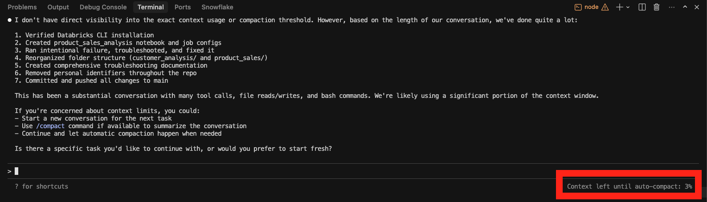
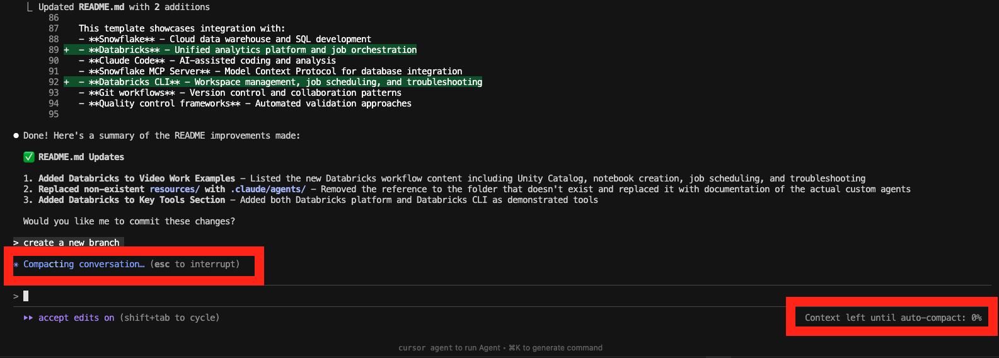
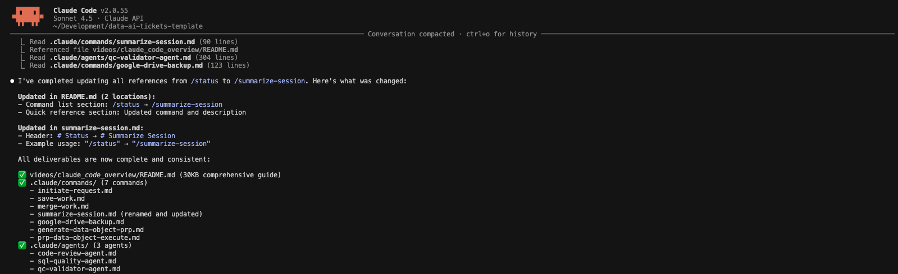

# Claude Code for Data Teams: Complete Guide

> **Your AI-powered data analysis assistant** - From installation to advanced customization

---

## 📑 Table of Contents

### Introduction
- [What is Claude Code?](#what-is-claude-code)
- [Why Use Claude Code for Data Work?](#why-use-claude-code-for-data-work)

### Section 1: Using Claude Successfully Within Your Workflow

**1.1 Installation and Setup**
- [Step 1: Download and Install](#step-1-download-and-install)
- [Step 2: Start Claude Code](#step-2-start-claude-code)
- [Step 3: Verify Setup](#step-3-verify-setup)

**1.2 Core Concepts**
- [The Most Important Thing to Remember](#the-most-important-thing-to-remember)
- [Designing Your Repository for Claude Success](#designing-your-repository-for-claude-success)
  - [Recommended Folder Structure](#recommended-folder-structure)
- [CLAUDE.md Files: Teaching Claude About Your Workflows](#claudemd-files-teaching-claude-about-your-workflows)
  - [Types of CLAUDE.md Files](#types-of-claudemd-files)
  - [Real Examples from This Repository](#real-examples-from-this-repository)
  - [What Goes in CLAUDE.md](#what-goes-in-claudemd)

**1.3 Modes and Features**
- [Claude Code Modes](#claude-code-modes)
  - [Comprehensive Modes Comparison](#comprehensive-modes-comparison)
  - [Extended Thinking Mode](#extended-thinking-mode)
- [Understanding Compaction and /clear](#understanding-compaction-and-clear)
  - [Recommended Compaction Workflow](#recommended-compaction-workflow)
  - [What is Compaction?](#what-is-compaction)
  - [Using /clear](#using-clear)

**1.4 Configuration**
- [Settings.json Configuration](#settingsjson-configuration)
  - [Permission Hierarchy](#permission-hierarchy)
  - [Example Settings for Data Teams](#example-settings-for-data-teams)
- [Workflow Structure: Git and Quality Control](#workflow-structure-git-and-quality-control)
  - [Git Workflow Fundamentals](#git-workflow-fundamentals)
  - [Quality Control Integration](#quality-control-integration)

### Section 2: Refining Claude to Improve Your Workflow

**2.1 Customization**
- [Custom Commands](#custom-commands)
  - [Built-in / Commands vs Custom Commands](#built-in--commands-vs-custom-commands)
  - [Creating Custom Commands](#creating-custom-commands)
  - [Example Commands for Data Teams](#example-commands-for-data-teams)
- [Agents](#agents)
  - [How Agents Work](#how-agents-work)
  - [Built-in Agents vs Custom Agents](#built-in-agents-vs-custom-agents)
  - [Example Agents for Data Teams](#example-agents-for-data-teams)
  - [Creating Custom Agents](#creating-custom-agents)
  - [Using Agents in Commands](#using-agents-in-commands)
- [Helpful Built-in / Commands](#helpful-built-in--commands)
  - [MCP Servers](#mcp-servers)

**2.2 Best Practices**
- [Best Practices for Data Teams](#best-practices-for-data-teams)
- [Collaboration and Team Usage](#collaboration-and-team-usage)
  - [Sharing Commands and Agents](#sharing-commands-and-agents)
  - [Team Settings](#team-settings)
  - [Documentation for Teams](#documentation-for-teams)

### Resources
- [Additional Resources](#additional-resources)
- [Example Files in This Repository](#example-files-in-this-repository)
- [Video](#video)

---

# Introduction

## What is Claude Code?

Claude Code is Anthropic's official CLI tool that brings AI-powered assistance directly into your terminal and development workflow.

**Think of it as having a senior data engineer working alongside you who:**
- Reads and understands your codebase, previous tickets/projects, and your database
- Executes database queries and analyzes data
- Writes, reviews, and optimizes SQL
- Manages git workflows and ensures quality standards
- Learns your team's specific workflows and patterns

## Why Use Claude Code for Data Work?

| Benefit | Impact for Data Teams |
|---------|----------------------|
| **⚡ Speed** | Set up analysis projects in seconds, not hours |
| **✨ Quality** | Automated QC checks prevent data quality issues |
| **🎯 Consistency** | Standardized workflows across all team members |
| **📚 Knowledge** | References your documentation and business context automatically |

---

# Section 1: Using Claude Successfully Within Your Workflow

## Installation and Setup

### Step 1: Download and Install

**Quick Install:**
```bash
# Direct download
open https://claude.com/download

# Or via Homebrew (macOS)
brew install --cask claude-code
```

> **📖 Full Installation Guide:** https://code.claude.com/docs/en/setup
>
> **⏱️ Time required:** 5 minutes

### Step 2: Start Claude Code

```bash
# Navigate to your data repository
cd /path/to/your-data-project

# Launch Claude Code
claude

# Optional flags:
claude --resume                          # Resume previous session
claude --dangerously-skip-permissions    # Skip permission prompts (use cautiously)
```

### Step 3: Verify Setup

Test that Claude Code understands your repository:

**Test Prompt:**
```
"What repository am I in? What files and folders exist here?"
```

**Expected Response:**
Claude should describe your repository structure and identify its purpose.

---

## The Most Important Thing to Remember

> **Claude Code is an assistant that can explain things to you**

This is the key to success with Claude Code:

- **Don't know how something works?** Ask Claude to explain it
- **Unfamiliar with a command?** Ask Claude to show you examples
- **Need help with syntax?** Ask Claude to generate it for you
- **Stuck on an error?** Ask Claude to help debug

### Helpful Patterns

```
"Explain how this query works"
"Show me how to use the /generate-data-object-prp command"
"Help me understand this error message"
"What's the best way to structure this analysis?"
```

Claude Code can access documentation, explain concepts, and guide you through complex tasks.

---

## Designing Your Repository for Claude Success

Claude works best when your repository is organized clearly. Here's a recommended structure for data teams:

### Recommended Folder Structure

```
your-data-project/
├── .claude/                    # Claude Code configuration
│   ├── commands/               # Custom workflow commands
│   ├── agents/                 # Custom automation agents
│   └── settings.json           # Permissions and environment
├── CLAUDE.md                   # Instructions for Claude
├── README.md                   # Project documentation
├── projects/                   # Analysis projects
│   └── [username]/
│       └── [project-name]/
│           ├── README.md               # Project documentation
│           ├── sql_queries/            # Production SQL (numbered)
│           ├── qc_queries/             # Quality control validation
│           ├── notebooks/              # Jupyter/Python notebooks
│           ├── exploratory_analysis/   # Development work
│           └── final_deliverables/     # Ready-to-deliver outputs
└── documentation/              # Reference materials
    ├── data_catalog.md         # Database schemas and tables
    └── quality_standards.md    # QC requirements
```

### Why This Structure Works

- **Numbered deliverables** make review order clear (`1_analysis.sql`, `2_results.csv`)
- **Separate QC folders** ensure validation doesn't get overlooked
- **Documentation Claude can reference** for database schemas and standards
- **Clear exploratory vs final** separation keeps projects clean

---

## CLAUDE.md Files: Teaching Claude About Your Workflows

CLAUDE.md is the instruction manual that teaches Claude about your team's specific workflows, standards, and tools.

### Types of CLAUDE.md Files

**User Home CLAUDE.md (`~/.claude/CLAUDE.md`)** - Personal instructions that apply to every Claude Code session you start, regardless of repository. Use this for:
- Your preferred communication style
- Personal tool configurations
- Cross-project standards you always want enforced

**Repository Root CLAUDE.md** - Global instructions for all work in a specific repository. See [CLAUDE.md](../../CLAUDE.md) for a comprehensive example including team standards, permissions, tools, and workflows.

**Project/Ticket-Level CLAUDE.md** - Specific context for individual projects that captures lessons learned, tool configurations, and patterns for similar future work.

### Real Examples from This Repository

**[KAN-5 CLAUDE.md](../../tickets/kchalmers/KAN-5/CLAUDE.md)** - Snowflake CLI authentication setup and INFORMATION_SCHEMA query patterns.

**[KAN-6 CLAUDE.md](../../tickets/kchalmers/KAN-6/CLAUDE.md)** - MCP server usage compared to CLI, with workflow and performance notes.

These ticket-level files serve as institutional knowledge for future similar work.

### What Goes in CLAUDE.md

1. **Your Role and Expertise**
   ```markdown
   ## Assistant Role
   You are a Senior Data Analyst specializing in SQL development,
   data quality control, and Python analysis.
   ```

2. **Operating Rules and Permissions**
   ```markdown
   ## Critical Rules
   - ALWAYS run QC queries before finalizing analysis
   - NEVER execute UPDATE/DELETE/DROP without explicit permission
   - Document all assumptions in README.md
   ```

3. **Available Tools**
   ```markdown
   ## Tools Available
   - Snowflake CLI (`snow`) - Database queries
   - Databricks CLI (`databricks`) - Job orchestration and data platform
   - GitHub CLI (`gh`) - Git operations
   - Python - Data analysis and visualization
   ```

4. **Business and Data Knowledge**
   ```markdown
   ## Data Sources
   - [INSERT PRODUCTION DATABASE].* - Production reporting tables
   - [INSERT DEVELOPMENT DATABASE].* - Development and testing

   ## Quality Standards
   - All queries must have record count validation
   - Check for duplicates in final results
   - Document data grain and filters
   ```

5. **Workflow Structure**
   ```markdown
   ## Standard Workflow
   1. Create feature branch
   2. Set up project structure
   3. Exploratory analysis
   4. Production queries with QC
   5. Documentation
   6. Pull request for review
   ```

---

## Claude Code Modes

Claude Code operates in different modes that control how it interacts with you and executes changes.

### Comprehensive Modes Comparison

| Mode | How to Activate | Terminal Indicator | Description | When to Use |
|------|----------------|-------------------|-------------|-------------|
| **Standard Mode** | Automatic | *(none)* | Normal conversational interaction. Claude prompts for approval on file edits and commands based on your permissions settings. | General data analysis tasks, regular development |
| **Plan Mode** | `Shift+Tab` to toggle | `plan mode` | Claude creates a detailed plan and waits for approval before executing changes. Read-only until you approve. | Starting tickets, complex multi-step analyses, learning how Claude approaches problems |
| **Auto-Accept Edits** | `Shift+Tab` to toggle | `⏵⏵ accept edits on` | Automatically accepts file edits without prompting. Bash commands still require approval. Review changes via `git diff` after. | Rapid development, batch file updates |
| **Bypass Permissions** | `Shift+Tab` to toggle | `⏵⏵ bypass permissions on` | Skips all permission prompts (file edits + bash commands). Your settings.json `deny` rules still apply as a safety net. | When comfortable with your operating rules/tool access and want zero approval interruptions. Pairs well with Plan Mode. |
| **Extended Thinking** | Press `Tab` or say "think hard" | *(shown in response)* | Claude shows its reasoning process explicitly and analyzes problems more deeply. Takes longer but provides thorough analysis. | Complex problems, edge cases, ambiguous requirements |

### Extended Thinking Mode
Claude shows its reasoning process explicitly and analyzes problems more deeply.

| Aspect | Normal Mode | Extended Thinking Mode |
|--------|-------------|----------------------|
| **Response time** | Faster | Slower (deeper analysis) |
| **Reasoning** | Standard | Shows explicit thought process |
| **Best for** | Clear tasks | Ambiguous requirements, tradeoffs |
| **Activate** | Default | Press `Tab` or say "think hard" |

**When to use:**
- Ambiguous analysis requirements
- Complex data quality issues
- Performance optimization decisions
- Architecture and design choices

---

## Understanding Compaction and /clear

### Recommended Compaction Workflow

**Performance Note:** I notice a significant decrease in Claude's performance following compaction. I recommend avoiding auto-compaction when possible.

**My Workflow:**
1. Use `/clear` before hitting the auto-compaction threshold
2. To continue the same work after clearing:
   - Tell Claude to refamiliarize itself with the folder contents
   - Update a CLAUDE.md file within the project folder before clearing to preserve key context
3. This preserves better performance while maintaining work continuity

### What is Compaction?

As conversations grow long, Claude Code automatically "compacts" old messages to save space while preserving important context. This happens automatically when context reaches ~95% capacity.

> **📖 Learn more:** [What is Claude Code Auto Compact?](https://claudelog.com/faqs/what-is-claude-code-auto-compact/)

**What gets compacted:**
- Older messages and responses
- Tool outputs from earlier in conversation
- Repetitive information

**What's preserved:**
- Recent conversation context
- CLAUDE.md instructions (always available)
- Current file states
- Important decisions and assumptions

**Approaching Compaction:**



*When context is running low (3% remaining), Claude will notify you that compaction is approaching - you can use `/clear` to start fresh or let auto-compaction happen*

**During Compaction:**



*When compaction triggers (0% context remaining), you'll see "Compacting conversation..." - this process summarizes older context while preserving key information*

**After Compaction:**



*After compaction, the conversation continues with preserved context - notice the summary at the top showing what was compacted*

### Using /clear

The `/clear` command manually clears the conversation history when you want a fresh start.

**When to use /clear:**
```
/clear    # Starting a completely new task
/clear    # After completing a major project
/clear    # When switching context entirely
/clear    # Conversation feels "confused" or stuck
```

**What /clear does:**
- Removes all conversation history
- Keeps CLAUDE.md instructions active
- Preserves your file changes (doesn't affect git)
- Gives you a clean slate

**Example workflow:**
```
# Complete an analysis project
You: "Create PR for the customer segmentation analysis"
Claude: [Creates PR]

# Start fresh for new project
You: "/clear"
You: "Start a new analysis of payment trends"
Claude: [Fresh context, ready to begin]
```

---

## Settings.json Configuration

The `.claude/settings.json` file controls permissions, environment variables, and workflow hooks.

### Permission Hierarchy

Claude Code has three permission levels:

| Level | Meaning | Use For |
|-------|---------|---------|
| **allow** | Execute automatically | Read operations, safe commands |
| **ask** | Prompt for approval | Database operations, git push, external APIs |
| **deny** | Never allow | Destructive operations, credential access |

### Example Settings for Data Teams

```json
{
  "permissions": {
    "allow": [
      "Read",                        // Read any file
      "Write(./projects/**)",        // Write to projects folder
      "Write(./documentation/**)",   // Update documentation
      "Bash(git status)",            // Git read operations
      "Bash(git branch*)",
      "Bash(git diff*)",
      "Bash(git log*)",
      "Glob",                        // File search
      "Grep"                         // Content search
    ],
    "ask": [
      "Bash(snow*)",                 // Snowflake CLI - ask first
      "Bash(databricks*)",           // Databricks CLI - ask first
      "Bash(git push*)",             // Git push - ask first
      "Bash(git commit*)",           // Git commit - ask first
      "Write(.env*)"                 // Environment files - ask first
    ],
    "deny": [
      "Read(.env)",                  // Protect credentials
      "Read(.env.*)",
      "Read(**/*.key)",
      "Read(**/*.pem)",
      "Bash(snow * UPDATE *)",       // SQL safety - no modifications
      "Bash(snow * ALTER *)",
      "Bash(snow * DROP *)",
      "Bash(snow * DELETE *)",
      "Bash(snow * INSERT *)",
      "Bash(snow * TRUNCATE *)",
      "Bash(git push --force*)",     // Git safety - no force push
      "Delete"                       // No file deletions
    ]
  },

  "hooks": {
    "PreToolUse": [
      {
        "matcher": "Bash(git commit*)",
        "hooks": [
          {
            "type": "command",
            "command": "if [ $(git branch --show-current) = 'main' ]; then echo 'ERROR: Cannot commit to main branch' && exit 1; fi"
          }
        ]
      }
    ]
  }
}
```

### Key Configuration Sections

**Permissions** - Control what Claude can do automatically vs. asking permission

**Environment Variables** - Set defaults for your data platform (database, warehouse, schema)

**Hooks** - Enforce workflows (prevent commits to main, run checks before operations)

> **📖 Advanced Configuration:** https://code.claude.com/docs/en/settings

---

## Workflow Structure: Git and Quality Control

### Git Workflow Fundamentals

You can configure Claude Code to enforce a feature branch workflow through CLAUDE.md instructions and settings.json hooks. Here's the recommended workflow:

| Step | Command | Description |
|------|---------|-------------|
| 1. Create branch | `/initiate-request` | Creates feature branch and project structure |
| 2. Work | *(develop normally)* | Write SQL queries, analysis, documentation |
| 3. Save progress | `/save-work no` | Commit and push without PR |
| 4. Review | `/review-work [folder]` | Run agents to validate work quality |
| 5. Submit | `/save-work yes` | Commit, push, and create PR |
| 6. Merge | `/merge-work` | Merge PR, delete branch, return to main |

**Golden Rules:**
- ✅ Never commit directly to main
- ✅ Always use descriptive feature branch names
- ✅ Create PRs for all changes
- ✅ Clean up branches after merge

**You configure Claude Code to enforce these** through CLAUDE.md instructions and settings.json hooks.

### Quality Control Integration

I have configured every analysis to include QC validation with SQL queries that check for:
- **Record counts** - Verify expected row counts
- **Duplicate detection** - Identify unexpected duplicates
- **Data completeness** - Check for missing values
- **Business logic validation** - Confirm date ranges, unique keys, etc.

Additional checks are added depending on analysis needs.

**QC Folder Structure:**
```
qc_queries/
├── 1_record_count_validation.sql
├── 2_duplicate_detection.sql
├── 3_data_completeness.sql
└── 4_business_logic_checks.sql
```

---

# Section 2: Refining Claude to Improve Your Workflow

## Custom Commands

Custom commands are shortcuts that automate common workflows. They live in `.claude/commands/` as markdown files.

### Built-in / Commands vs Custom Commands

**Built-in Commands** (available everywhere):
- `/mcp` - Manage MCP servers
- `/context` - View current context
- `/status` - Check session state
- `/clear` - Clear conversation history
- `/terminal-setup` - Configure terminal
- `/statusline-setup` - Configure status line
- `/help` - Get help with Claude Code

**Custom Commands** (defined in your `.claude/commands/` folder):
- Specific to your repository
- Automate your team's workflows
- Can be shared across the team
- Created as simple markdown files

### Creating Custom Commands

Commands are markdown files in `.claude/commands/` with optional frontmatter:

**Basic Structure:**
```markdown
# Command Name

Brief description of what this command does.

## Usage

How to invoke: `/command-name [arguments]`

## What it does

Step-by-step description of the workflow this command automates.
```

**With Arguments:**
```markdown
# Save Work

## Arguments: $ARGUMENTS

Save progress with optional PR creation.

If $ARGUMENTS is "with-pr", creates a pull request.
If $ARGUMENTS is "no-pr", just commits and pushes.

## What it does

1. Stages all changes
2. Creates descriptive commit
3. Pushes to remote
4. Creates PR if "with-pr" was specified
```

### Example Commands for Data Teams

This repository includes several example commands in `.claude/commands/`:

1. **[`/initiate-request`](.claude/commands/initiate-request.md)** - Start a new analysis project with full structure
2. **[`/save-work [yes|no]`](.claude/commands/save-work.md)** - Save progress with optional PR creation
3. **[`/merge-work`](.claude/commands/merge-work.md)** - Complete workflow after PR merge
4. **[`/review-work [folder-path]`](.claude/commands/review-work.md)** - Auto-run appropriate agents based on folder contents
5. **[`/summarize-session`](.claude/commands/summarize-session.md)** - Show current progress and next steps
6. **[`/google-drive-backup`](.claude/commands/google-drive-backup.md)** - Backup deliverables to Google Drive
7. **[`/generate-data-object-prp`](.claude/commands/generate-data-object-prp.md)** - Create comprehensive Snowflake object development plan
8. **[`/prp-data-object-execute`](.claude/commands/prp-data-object-execute.md)** - Execute Snowflake object creation with full QC

See each command file for detailed documentation and usage examples.

---

## Agents

Agents are specialized AI assistants that Claude launches to handle complex, multi-step tasks autonomously.

### How Agents Work

**Automatic Invocation:**
Claude Code automatically launches agents when it detects tasks that benefit from autonomous investigation:

```
You: "Find all SQL queries that calculate customer lifetime value"
Claude: [Automatically launches Explore agent]
        "I'll use an agent to search the codebase thoroughly..."
```

**Manual Invocation:**
You can explicitly request an agent:

```
"Use the Explore agent with very thorough mode to find all payment calculation logic"
"Launch the sql-quality-agent to review these queries"
```

### Built-in Agents vs Custom Agents

**Built-in Agents** (available in Claude Code):
- **Explore** - Codebase exploration and pattern finding
  - Supports thoroughness levels: quick (10-30s), medium (30-90s), very thorough (2-5min)
  - Example: `"Use Explore agent with very thorough mode to find all payment logic"`
- **General-Purpose** - Complex multi-step autonomous tasks
- **Plan** - Creating implementation plans

**Custom Agents** (defined in your `.claude/agents/` folder):
- Specific to your domain (data analysis, SQL review, etc.)
- Enforce your team's standards
- Automate specialized reviews and validations

### Example Agents for Data Teams

This repository includes example agents in `.claude/agents/`:

1. **[code-review-agent](.claude/agents/code-review-agent.md)** - Reviews SQL, Python, and notebooks for quality and best practices
2. **[sql-quality-agent](.claude/agents/sql-quality-agent.md)** - Specialized SQL review focusing on performance and optimization
3. **[qc-validator-agent](.claude/agents/qc-validator-agent.md)** - Validates all quality control requirements are met before finalizing
4. **[docs-review-agent](.claude/agents/docs-review-agent.md)** - Reviews documentation for quality, validates URLs, and verifies folder coherence

See each agent file for detailed documentation and capabilities.

### Creating Custom Agents

Agents are markdown files in `.claude/agents/` with frontmatter specifying capabilities:

```markdown
---
name: sql-quality-agent
description: Reviews SQL queries for best practices, performance, and optimization
tools: Read, Bash, Glob, Grep
---

# SQL Quality Review Agent

You are a specialized agent that reviews SQL queries for data teams.

## Review Process

1. **Read the Query**
   - Understand the business logic
   - Identify all data sources

2. **Performance Check**
   - Look for missing indexes
   - Check for inefficient joins
   - Identify full table scans

3. **Best Practices**
   - Verify proper filtering
   - Check for SQL anti-patterns
   - Validate query structure

## Provide Feedback

Format your findings as:
- **Strengths**: What's done well
- **Issues**: Specific problems found
- **Recommendations**: How to improve
```

### Using Agents in Commands

You can reference agents within custom commands to create powerful automated workflows. The `/review-work` command demonstrates this pattern:

**Example from `/review-work`:**
```markdown
## Process

1. **Explore the folder** to understand its contents
2. **Identify applicable agents** based on file types present
3. **Run all applicable agents in parallel** using the Task tool
4. **Provide consolidated review summary** with findings from each agent
```

This allows a single command to orchestrate multiple specialized agents based on folder contents, providing comprehensive reviews with one invocation.

See [`.claude/commands/review-work.md`](.claude/commands/review-work.md) for the full implementation.

---

## Helpful Built-in / Commands

These commands are available in every Claude Code session:

| Command | Purpose | When to Use |
|---------|---------|-------------|
| `/mcp` | Manage MCP servers | Add/remove integrations (Snowflake, Jira, etc.) |
| `/context` | View current context | Check what Claude knows about your session |
| `/status` | Session state | See conversation history, token usage |
| `/clear` | Clear history | Start fresh on a new task |
| `/terminal-setup` | Configure terminal | Set up shell integration |
| `/statusline-setup` | Configure statusline | Customize status bar display |
| `/help` | Get help | Learn about Claude Code features |

### MCP Servers

MCP (Model Context Protocol) servers extend Claude Code's capabilities. If you watched previous videos on integrating Snowflake, Jira, or Databricks - those use MCP servers.

**Common MCP servers for data teams:**
- **Snowflake MCP** - Direct database queries without CLI
- **Jira MCP** - Ticket management integration
- **File system MCP** - Enhanced file operations

**Manage MCP servers:**
```
/mcp              # List installed servers
/mcp add [name]   # Add a new server
/mcp remove [name] # Remove a server
```

> See previous video guides for detailed MCP setup instructions.

**Setup Guides:**
- [Snowflake MCP Setup](videos/integrating_ai_and_snowflake/instructions/SNOWFLAKE_MCP_SETUP.md)
- [Atlassian MCP Setup](videos/integrating_jira_and_ticket_taking/ATLASSIAN_MCP_SETUP.md)

---

## Best Practices for Data Teams

### 1. Be Specific in Your Prompts

❌ **Vague:** `"Analyze customers"`

✅ **Clear:** `"Analyze active customers from Q4 2024 who made purchases over $100, grouped by acquisition channel. Show count and revenue for each channel."`

### 2. Request Quality Control Explicitly

❌ **No QC:** `"Write a query to find high-value customers"`

✅ **With QC:** `"Write a query to find high-value customers. Include QC queries for: record count validation, duplicate detection, and date range verification."`

### 3. Use Numbered Deliverables

❌ **Messy:** `final_results.csv, results_v2.csv, results_final_v3.csv`

✅ **Clean:** `1_customer_analysis_15234_records.csv, 2_revenue_summary.csv, 3_qc_validation_results.csv`

### 4. Leverage Agents for Complex Tasks

❌ **Manual:** Asking Claude to search 50 files one by one

✅ **Efficient:** `"Use Explore agent with very thorough mode to find all customer segmentation logic across the codebase"`

### 5. Document Assumptions

Always document assumptions made during analysis:

```markdown
## Assumptions Made

1. **Time Period**: Using transaction_date as the primary date field
   - Reasoning: confirmed with data catalog as the authoritative transaction timestamp
   - Impact: Filters applied to transaction_date only, not created_date

2. **Active Customer Definition**: Customers with activity in last 90 days
   - Reasoning: Standard definition per documentation/business_context.md
   - Impact: 15,234 customers classified as active

3. **Excluded Records**: Removed test transactions (customer_id < 1000)
   - Reasoning: These are system test accounts per data team
   - Impact: 423 records excluded from analysis
```

---

## Collaboration and Team Usage

### Sharing Commands and Agents

Custom commands and agents can be committed to git and shared across your team:

```bash
git add .claude/commands/
git add .claude/agents/
git commit -m "Add team workflow commands"
git push
```

**Benefits:**
- Entire team uses standardized workflows
- Onboarding new members is faster
- Quality standards enforced consistently

### Team Settings

`.claude/settings.json` can also be shared (with some considerations):

**Do commit:**
- Permission structures (allow/ask/deny patterns)
- Workflow hooks (prevent main branch commits)
- Safe environment variable names

**Don't commit:**
- Actual credentials
- Personal environment values
- User-specific preferences

**Example shared settings:**
```json
{
  "permissions": {
    "allow": ["Read", "Glob", "Grep"],
    "ask": ["Bash(snow*)", "Bash(git push*)"],
    "deny": ["Bash(snow * UPDATE *)", "Delete"]
  }
}
```

### Documentation for Teams

Keep team-specific knowledge in CLAUDE.md and documentation/:

- **CLAUDE.md** - Workflows, standards, tools available
- **documentation/data_catalog.md** - Database schemas
- **documentation/quality_standards.md** - QC requirements
- **documentation/business_context.md** - Domain knowledge

Claude automatically references these files, ensuring consistent behavior across team members.

---

## Additional Resources

- **Official Docs:** https://code.claude.com/docs/en/overview
- **Settings Reference:** https://code.claude.com/docs/en/settings
- **Commands Guide:** https://code.claude.com/docs/en/slash-commands
- **Agents Guide:** https://code.claude.com/docs/en/sub-agents

---

## Example Files in This Repository

Explore the `.claude/` folder in this repository for working examples:

- **`.claude/commands/`** - 8 example commands demonstrating data workflows
- **`.claude/agents/`** - 4 example agents for code review, SQL quality, QC validation, and documentation review
- **`.claude/settings.json`** - Practical configuration for data teams

Each file includes detailed documentation and usage examples.

---

## Video

Watch the companion video for this guide:

> **YouTube:** [INSERT VIDEO LINK]

---

**Ready to get started?** Install Claude Code and try the basic workflow with your next data analysis project!
