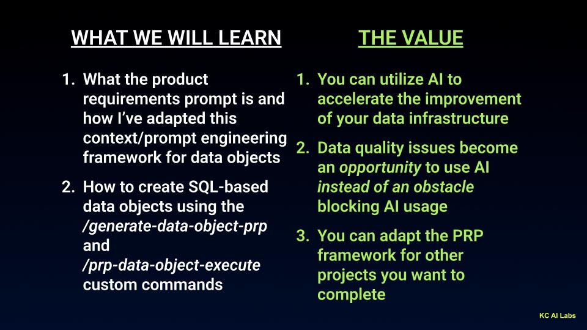

# Product Requirements Prompt (PRP) for Data Objects

> **YouTube:** [Stop Waiting: Use AI to Build Better Data Infrastructure with this Context Engineering Framework)](https://youtu.be/DUK39XqEVm0)

## The Value Proposition

With the help of AI, we can move from problematic data infrastructure with gaps to more completed, easy-to-use infrastructure. **Our data does not have to be in a final state to start the journey with AI** we can use AI to help us get there.



### What We Will Learn
1. What the product requirements prompt is and how it provides context for data object creation
2. How to create SQL-based data objects using the `/generate-data-object-prp` and `/prp-data-object-execute` custom commands

### The Value
1. You can utilize AI to accelerate the improvement of your data infrastructure
2. Data quality issues become an *opportunity* to use AI instead of an obstacle blocking AI usage
3. You can adapt the PRP framework for other projects you want to complete

---

## Introduction to Product Requirements Prompts

A **Product Requirements Prompt (PRP)** is a comprehensive specification document that gives an AI agent all the context it needs to implement a data object correctly with minimal iteration required.

This data object workflow is adapted from the **Context Engineering** framework. For deep dives on PRPs and context engineering, see:

- [Context Engineering Quick Start (Product Requirement Prompts)](https://www.youtube.com/watch?v=H3lCPUx7TEE) by [Rasmus Widing](https://www.youtube.com/@RasmusWiding)
- [Context Engineering is the New Vibe Coding (Learn this Now)](https://www.youtube.com/watch?v=Egeuql3Lrzg) by [Cole Medin](https://www.youtube.com/@ColeMedin)

### Why PRPs Matter

Traditional data object development often involves:
- Multiple iterations to understand requirements
- Missing edge cases discovered late
- Inconsistent quality control
- Poor documentation

PRPs solve this by front-loading the research and specification work, enabling **one-pass implementation success**.

---

## The Four-Phase Workflow

```
┌────────────────────────────────────────────────────────────────────────────────────────┐
│                                                                                        │
│  PHASE 1: DEFINE      PHASE 2: GENERATE      PHASE 3: EXECUTE      PHASE 4: PROMOTE    │
│  ────────────────     ─────────────────      ────────────────      ────────────────    │
│                                                                                        │
│  ┌─────────────┐      ┌─────────────┐       ┌─────────────┐       ┌─────────────┐      │
│  │             │      │             │       │    DEV      │       │    PROD     │      │
│  │  INITIAL.md │ ───▶ │     PRP     │ ───▶  │   Object    │ ───▶  │   Object    │      │
│  │  (Template) │      │  (Research) │       │   + QC      │       │  (Deploy)   │      │
│  │             │      │             │       │             │       │             │      │
│  └─────────────┘      └─────────────┘       └─────────────┘       └─────────────┘      │
│                                                                                        │
│  You fill out         AI researches         AI creates in         Review & deploy      │
│  requirements         & asks questions      DEV schema with       to PROD schema       │
│                                             production data                            │
│                                                                                        │
│  Output:              Output:               Output:               Output:              │
│  INITIAL.md           data-object-name.md   DEV object + docs     PROD object          │
│                                                                                        │
└────────────────────────────────────────────────────────────────────────────────────────┘
```

### Phase 1: Define Requirements (`INITIAL.md`)

**Purpose:** Capture your requirements in a structured format before AI research begins.

**What you do:**
- Copy the template from `PRPs/templates/data-object-initial.md`
- Fill in the object definition (name, type, target schema)
- Define the data grain and aggregation level
- Document business context and use cases
- List data sources and expected relationships
- Note any known data quality considerations

**Output:** `PRPs/your-project/INITIAL.md`

**Why this matters:** The INITIAL.md gives the AI a clear starting point. You're encoding your domain knowledge and requirements *before* the AI starts researching—ensuring the generated PRP addresses your actual needs.

### Phase 2: Generate PRP (`/generate-data-object-prp`)

**Purpose:** AI researches, analyzes, and creates a comprehensive specification based on your INITIAL.md.

**Command:**
```bash
/generate-data-object-prp PRPs/your-project/INITIAL.md
```

**What it does:**
- Performs deep database schema analysis using Snow CLI
- Maps data relationships and dependencies
- Assesses data quality (duplicates, nulls, joins)
- Validates architecture compliance
- Iteratively clarifies requirements with the user
- Generates a complete PRP document

**Output:** `PRPs/your-project/data-object-{name}.md`

### Phase 3: Execute PRP (`/prp-data-object-execute`)

**Purpose:** Implement and validate the data object in a development schema.

**Command:**
```bash
/prp-data-object-execute PRPs/your-project/data-object-{name}.md
```

**What it does:**
- Creates objects in **development schema** (e.g., DEVELOPMENT)
- Uses **production data sources** for realistic testing
- Implements comprehensive QC validation
- Optimizes query performance
- Generates documentation (README.md, CLAUDE.md)
- Prepares production deployment template

**Output:** Validated development object + deployment-ready SQL

**Why development first:** Testing with production data in a dev schema lets you validate behavior without risking production systems. QC catches issues before they reach end users.

### Phase 4: Promote to Production (Human-Executed)

**Purpose:** Human reviews and deploys the validated object to production.

**What you do:**
- Review QC results and development object behavior
- Review the generated `production_deploy_template.sql`
- **Execute the production script manually** after approval
- Validate the production object matches development

**Output from Phase 3:** `production_deploy_template.sql` - ready-to-execute deployment script

**Why human-executed:** Production deployment should always be a deliberate human decision. The AI prepares everything, but you control when and how it goes live. The deployment script handles COPY GRANTS, environment variables, and proper sequencing.

---

## Example 1: Simple TPC-H Customer Order Summary

**Scenario:** Create a view summarizing customer order metrics using Snowflake's sample TPC-H dataset.

**Dataset:** [Snowflake TPC-H Sample Data](https://docs.snowflake.com/en/user-guide/sample-data-tpch) - A standard decision support benchmark with 8 normalized tables (CUSTOMER, ORDERS, LINEITEM, NATION, REGION, PART, PARTSUPP, SUPPLIER).

This example demonstrates the "happy path" with clean, normalized data.

**Data Object:** `VW_CUSTOMER_ORDER_SUMMARY`
- **Type:** VIEW (simple, no materialization needed)
- **Grain:** One row per customer
- **Sources:** CUSTOMER, ORDERS, LINEITEM, NATION, REGION
- **Metrics:** Total orders, total revenue, average order value

### Artifacts
- [INITIAL.md](PRPs/01_simple_tpch/INITIAL.md) - The initial questionnaire
- PRP generated after execution

---

## Example 2: Multi-Grain Order Analytics

**Scenario:** Create a complex analytics table that combines multiple grains—demonstrating how AI handles "messy" real-world scenarios.

This example is inspired by examples I've found in my career where I've add to join multiple grains from multiple different data sources, which combines:
- Fine-grained detail (individual line items)
- Aggregated metrics (order-level summaries)
- Rankings and comparisons (customer-level window functions)

**Data Object:** `DT_ORDER_ANALYTICS_MULTI_GRAIN`
- **Complexity:** Mixed grains, window functions, conditional aggregations
- **Pattern:** CTE-based architecture joining multiple grain levels

### Artifacts
- [INITIAL.md](PRPs/02_multi_grain_analytics/INITIAL.md) - The initial questionnaire
- PRP generated after execution

---

## Adapting the Framework

The PRP workflow can be customized for your own data projects:

**Phase 1 - Define:**
1. Copy the template from `PRPs/templates/data-object-initial.md`
2. Fill in your requirements: grain, sources, business context, data quality notes

**Phase 2 - Generate:**
3. Run `/generate-data-object-prp PRPs/your-project/INITIAL.md`
4. Review AI's research findings and answer clarifying questions
5. Validate assumptions before PRP is finalized

**Phase 3 - Execute (Development):**
6. Run `/prp-data-object-execute PRPs/your-project/data-object-name.md`
7. AI creates object in dev schema with production data sources
8. Review QC results and validate development object

**Phase 4 - Promote (Human-Executed):**
9. Review the generated `production_deploy_template.sql`
10. Execute deployment script in production when ready

### Key Customization Points
- **Object Type:** VIEW, TABLE, or DYNAMIC_TABLE
- **Target Schema:** Match your architecture layers
- **Performance Requirements:** Refresh patterns, retention
- **Data Quality Handling:** How to treat duplicates, missing data

---

## Command Reference

### Generate Command
```bash
/generate-data-object-prp PRPs/your-project/INITIAL.md
```

### Execute Command
```bash
/prp-data-object-execute PRPs/your-project/data-object-name.md
```

---

## Files in This Project

```
videos/prp_data_object_video/
├── README.md                           # This file
└── PRPs/
    ├── templates/
    │   └── data-object-initial.md      # Template for new projects
    ├── 01_simple_tpch/
    │   └── INITIAL.md                  # Simple example questionnaire
    └── 02_multi_grain_analytics/
        └── INITIAL.md                  # Complex example questionnaire
```
